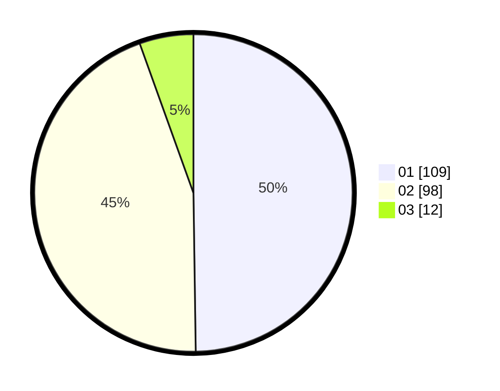

# Hasil

Hasil perolehan suara paslon dapat dilihat pada file paslon-01.txt, paslon-02.txt, dan paslon-03.txt.

Jika tidak ada, artinya data tersebut belum ada pada SIREKAP.

## Perolehan Suara

 * Paslon 01: **109**.
 * Paslon 02: **98**.
 * Paslon 03: **12**.

## Foto C Plano

https://sirekap-obj-formc.kpu.go.id/97ab/pemilu/ppwp/31/73/04/10/08/3173041008040-20240214-192734--40135e01-2809-4b5b-8cc2-9f1264fe5fe0.jpg

https://sirekap-obj-formc.kpu.go.id/97ab/pemilu/ppwp/31/73/04/10/08/3173041008040-20240214-192747--e11a006a-e915-4b2d-80d4-fe8769ac67a7.jpg

https://sirekap-obj-formc.kpu.go.id/97ab/pemilu/ppwp/31/73/04/10/08/3173041008040-20240214-192753--3f8a1a63-634b-40dd-a700-f39d393fb368.jpg

## DATA PEMILIH TETAP

Jumlah pemilih dalam DPT: **277**.
 * L: **130**.
 * P: **147**.

## DATA PENGGUNA HAK PILIH

Jumlah pengguna hak pilih dalam DPT: **221**.
 * L: **106**.
 * P: **115**.

Jumlah pengguna hak pilih dalam DPTb: **1**.
 * L: **1**.
 * P: **0**.

Jumlah pengguna hak pilih dalam DPK: **222**.
 * L: **107**.
 * P: **115**.

Jumlah pengguna hak pilih: **222**.
 * L: **127**.
 * P: **115**.

## JUMLAH SUARA SAH DAN TIDAK SAH

JUMLAH SELURUH SUARA SAH: **219**.

JUMLAH SUARA TIDAK SAH: **3**.

JUMLAH SELURUH SUARA SAH DAN SUARA TIDAK SAH: **222**.
