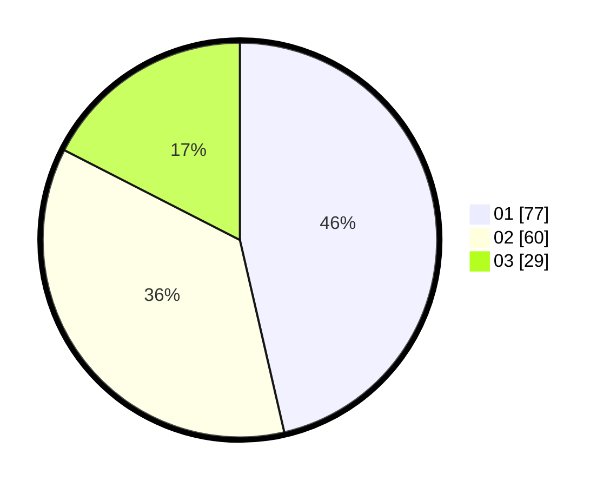

# Hasil

Hasil perolehan suara paslon dapat dilihat pada file paslon-01.txt, paslon-02.txt, dan paslon-03.txt.

Jika tidak ada, artinya data tersebut belum ada pada SIREKAP.

## Perolehan Suara

 * Paslon 01: **77**.
 * Paslon 02: **60**.
 * Paslon 03: **29**.

## Foto C Plano

https://sirekap-obj-formc.kpu.go.id/77b8/pemilu/ppwp/31/73/04/10/08/3173041008041-20240214-230919--016d5ef0-f81a-48bd-a6dc-b879f090de03.jpg

https://sirekap-obj-formc.kpu.go.id/77b8/pemilu/ppwp/31/73/04/10/08/3173041008041-20240215-161024--fc362337-7f77-4c63-999e-ee5f90a3e3c7.jpg

https://sirekap-obj-formc.kpu.go.id/77b8/pemilu/ppwp/31/73/04/10/08/3173041008041-20240214-231125--ca2f32c0-94df-4b5f-81c8-a38cb48ff7ae.jpg

## DATA PEMILIH TETAP

Jumlah pemilih dalam DPT: **215**.
 * L: **103**.
 * P: **112**.

## DATA PENGGUNA HAK PILIH

Jumlah pengguna hak pilih dalam DPT: **166**.
 * L: **76**.
 * P: **90**.

Jumlah pengguna hak pilih dalam DPTb: **2**.
 * L: **0**.
 * P: **2**.

Jumlah pengguna hak pilih dalam DPK: **1**.
 * L: **1**.
 * P: **0**.

Jumlah pengguna hak pilih: **169**.
 * L: **77**.
 * P: **92**.

## JUMLAH SUARA SAH DAN TIDAK SAH

JUMLAH SELURUH SUARA SAH: **166**.

JUMLAH SUARA TIDAK SAH: **3**.

JUMLAH SELURUH SUARA SAH DAN SUARA TIDAK SAH: **169**.
