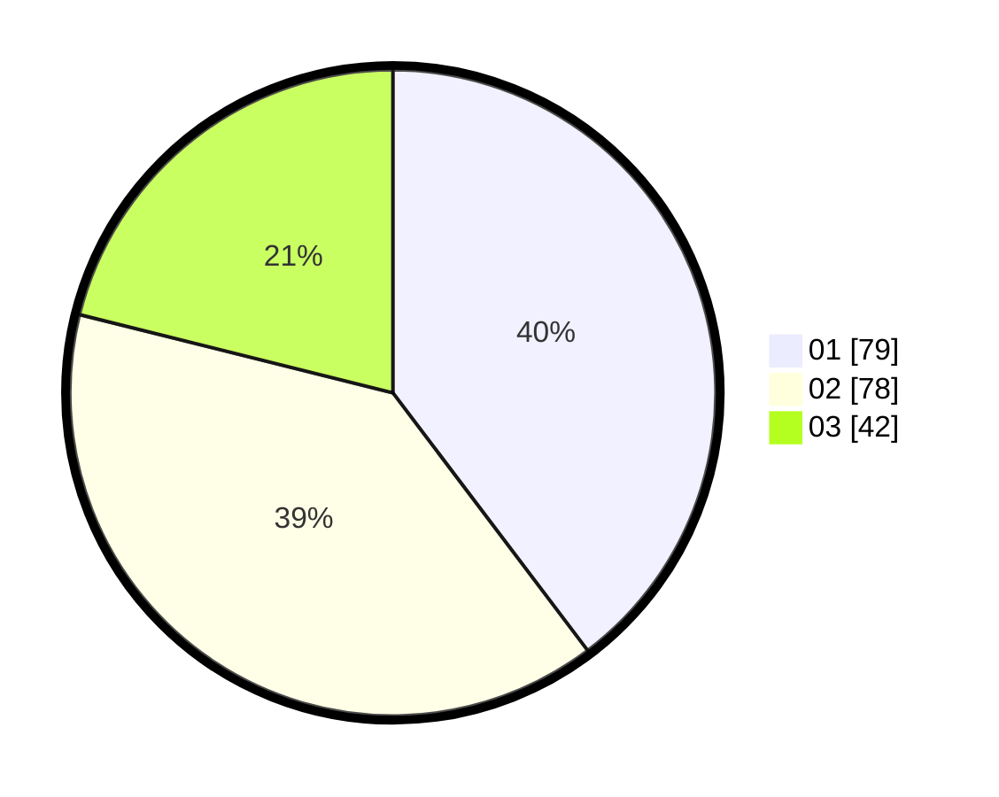

# Hasil

Hasil perolehan suara paslon dapat dilihat pada file paslon-01.txt, paslon-02.txt, dan paslon-03.txt.

Jika tidak ada, artinya data tersebut belum ada pada SIREKAP.

## Perolehan Suara

 * Paslon 01: **79**.
 * Paslon 02: **78**.
 * Paslon 03: **42**.

## Foto C Plano

https://sirekap-obj-formc.kpu.go.id/da29/pemilu/ppwp/31/73/04/10/08/3173041008043-20240214-192114--f5670fcd-8bf5-4c45-a9a7-d870251f4056.jpg

https://sirekap-obj-formc.kpu.go.id/da29/pemilu/ppwp/31/73/04/10/08/3173041008043-20240214-194456--a579e3bb-46a7-4504-b9b2-0a7550efe270.jpg

https://sirekap-obj-formc.kpu.go.id/da29/pemilu/ppwp/31/73/04/10/08/3173041008043-20240214-193114--692848a3-1882-4961-800a-2e7ae1a5e351.jpg

## DATA PEMILIH TETAP

Jumlah pemilih dalam DPT: **204**.
 * L: **111**.
 * P: **93**.

## DATA PENGGUNA HAK PILIH

Jumlah pengguna hak pilih dalam DPT: **202**.
 * L: **110**.
 * P: **92**.

Jumlah pengguna hak pilih dalam DPTb: **1**.
 * L: **1**.
 * P: **0**.

Jumlah pengguna hak pilih dalam DPK: **1**.
 * L: **0**.
 * P: **1**.

Jumlah pengguna hak pilih: **204**.
 * L: **111**.
 * P: **93**.

## JUMLAH SUARA SAH DAN TIDAK SAH

JUMLAH SELURUH SUARA SAH: **199**.

JUMLAH SUARA TIDAK SAH: **5**.

JUMLAH SELURUH SUARA SAH DAN SUARA TIDAK SAH: **204**.
