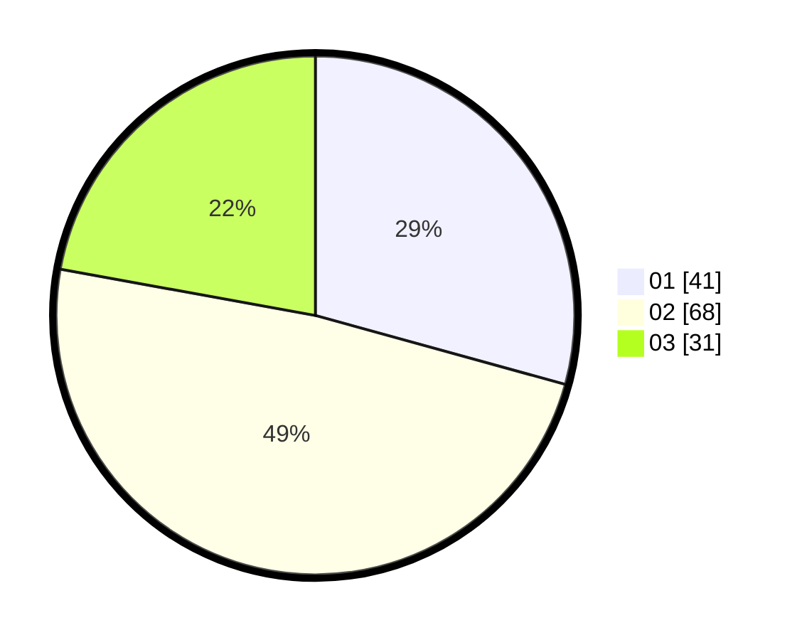

# Hasil

Hasil perolehan suara paslon dapat dilihat pada file paslon-01.txt, paslon-02.txt, dan paslon-03.txt.

Jika tidak ada, artinya data tersebut belum ada pada SIREKAP.

## Perolehan Suara

 * Paslon 01: **41**.
 * Paslon 02: **68**.
 * Paslon 03: **31**.

## Foto C Plano

https://sirekap-obj-formc.kpu.go.id/0831/pemilu/ppwp/31/73/04/10/08/3173041008045-20240214-212603--fae58304-f211-4396-8bf4-d782051d565a.jpg

https://sirekap-obj-formc.kpu.go.id/0831/pemilu/ppwp/31/73/04/10/08/3173041008045-20240214-155533--a88d9f61-82f9-47aa-99df-348e15c6033f.jpg

https://sirekap-obj-formc.kpu.go.id/0831/pemilu/ppwp/31/73/04/10/08/3173041008045-20240214-212843--1c1237ec-d55d-4a7b-8a95-5694e205bbd6.jpg
