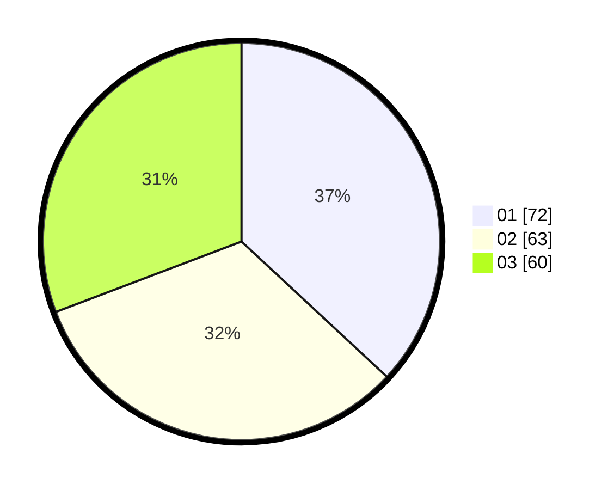

# Hasil

Hasil perolehan suara paslon dapat dilihat pada file paslon-01.txt, paslon-02.txt, dan paslon-03.txt.

Jika tidak ada, artinya data tersebut belum ada pada SIREKAP.

## Perolehan Suara

 * Paslon 01: **72**.
 * Paslon 02: **63**.
 * Paslon 03: **60**.

## Foto C Plano

https://sirekap-obj-formc.kpu.go.id/e636/pemilu/ppwp/31/73/04/10/08/3173041008048-20240214-184802--4f33531c-0da8-441c-a017-19821e445b81.jpg

https://sirekap-obj-formc.kpu.go.id/e636/pemilu/ppwp/31/73/04/10/08/3173041008048-20240214-185314--dd8e08cd-a761-4614-8755-c979a40cbd87.jpg

https://sirekap-obj-formc.kpu.go.id/e636/pemilu/ppwp/31/73/04/10/08/3173041008048-20240214-185429--9158c61d-1c4a-4eaa-8759-be1681997f70.jpg

## DATA PEMILIH TETAP

Jumlah pemilih dalam DPT: **277**.
 * L: **130**.
 * P: **147**.

## DATA PENGGUNA HAK PILIH

Jumlah pengguna hak pilih dalam DPT: **196**.
 * L: **95**.
 * P: **101**.

Jumlah pengguna hak pilih dalam DPTb: **2**.
 * L: **1**.
 * P: **1**.

Jumlah pengguna hak pilih dalam DPK: **0**.
 * L: **0**.
 * P: **0**.

Jumlah pengguna hak pilih: **198**.
 * L: **96**.
 * P: **102**.

## JUMLAH SUARA SAH DAN TIDAK SAH

JUMLAH SELURUH SUARA SAH: **195**.

JUMLAH SUARA TIDAK SAH: **3**.

JUMLAH SELURUH SUARA SAH DAN SUARA TIDAK SAH: **198**.
