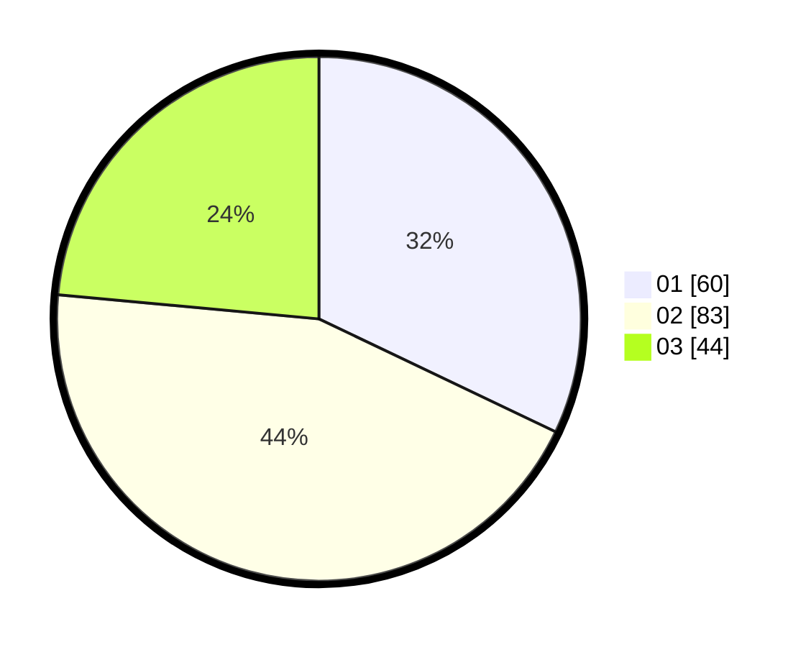

# Hasil

Hasil perolehan suara paslon dapat dilihat pada file paslon-01.txt, paslon-02.txt, dan paslon-03.txt.

Jika tidak ada, artinya data tersebut belum ada pada SIREKAP.

## Perolehan Suara

 * Paslon 01: **60**.
 * Paslon 02: **83**.
 * Paslon 03: **44**.

## Foto C Plano

https://sirekap-obj-formc.kpu.go.id/8cc9/pemilu/ppwp/31/73/04/10/08/3173041008049-20240214-232533--140c2c98-fc52-4732-ba2c-35cb002a8356.jpg

https://sirekap-obj-formc.kpu.go.id/8cc9/pemilu/ppwp/31/73/04/10/08/3173041008049-20240214-232737--8cb477e5-c7ec-446a-a325-9dc8062c76fa.jpg

https://sirekap-obj-formc.kpu.go.id/8cc9/pemilu/ppwp/31/73/04/10/08/3173041008049-20240214-233111--9ba8d422-db94-48b7-bc79-abbfb0cabf37.jpg
