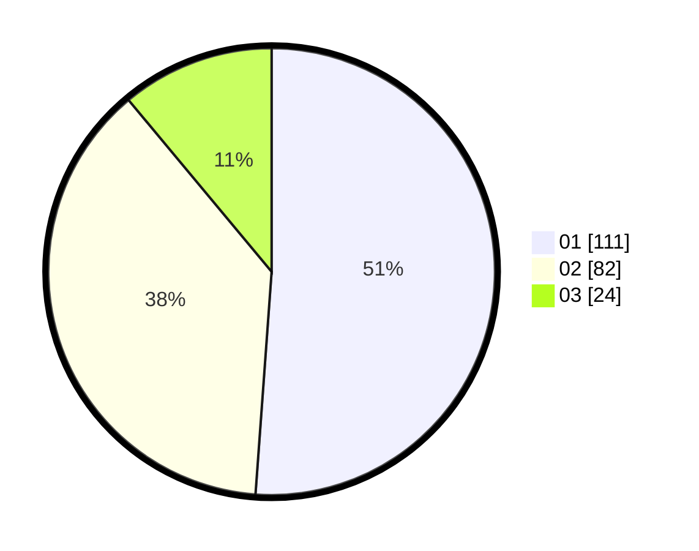

# Hasil

Hasil perolehan suara paslon dapat dilihat pada file paslon-01.txt, paslon-02.txt, dan paslon-03.txt.

Jika tidak ada, artinya data tersebut belum ada pada SIREKAP.

## Perolehan Suara

 * Paslon 01: **111**.
 * Paslon 02: **82**.
 * Paslon 03: **24**.

## Foto C Plano

https://sirekap-obj-formc.kpu.go.id/5624/pemilu/ppwp/31/73/04/10/08/3173041008052-20240214-232837--b592f1f3-b0fb-482e-b7cb-29488fe878a7.jpg

https://sirekap-obj-formc.kpu.go.id/5624/pemilu/ppwp/31/73/04/10/08/3173041008052-20240214-233031--2d8379db-7546-4a83-aabc-a39f56943e4d.jpg

https://sirekap-obj-formc.kpu.go.id/5624/pemilu/ppwp/31/73/04/10/08/3173041008052-20240214-233205--8ccb879f-9fb4-449d-a534-49f4ca06f725.jpg
