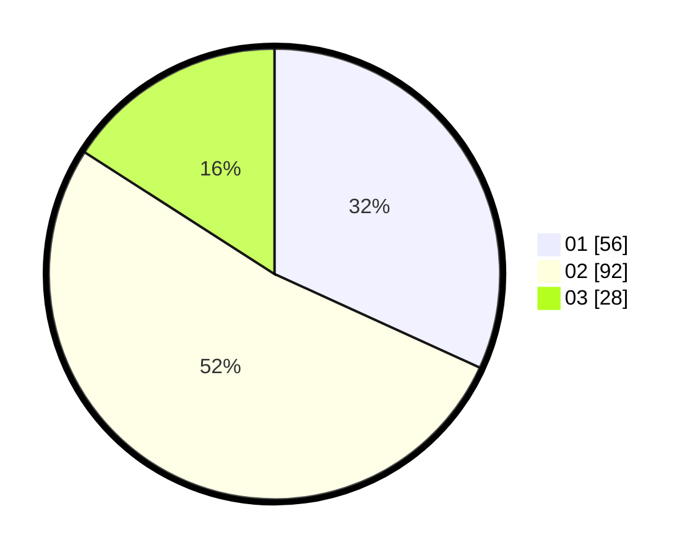

# Hasil

Hasil perolehan suara paslon dapat dilihat pada file paslon-01.txt, paslon-02.txt, dan paslon-03.txt.

Jika tidak ada, artinya data tersebut belum ada pada SIREKAP.

## Perolehan Suara

 * Paslon 01: **56**.
 * Paslon 02: **92**.
 * Paslon 03: **28**.

## Foto C Plano

https://sirekap-obj-formc.kpu.go.id/2abd/pemilu/ppwp/31/73/04/10/08/3173041008056-20240214-212238--1b768277-2594-48fb-8483-8075894ae31e.jpg

https://sirekap-obj-formc.kpu.go.id/2abd/pemilu/ppwp/31/73/04/10/08/3173041008056-20240214-212413--ad823ee7-e144-401c-bb34-ba8f8d29e4c1.jpg

https://sirekap-obj-formc.kpu.go.id/2abd/pemilu/ppwp/31/73/04/10/08/3173041008056-20240214-212457--fd13154b-bab4-47cc-8fe3-f170c3386213.jpg
