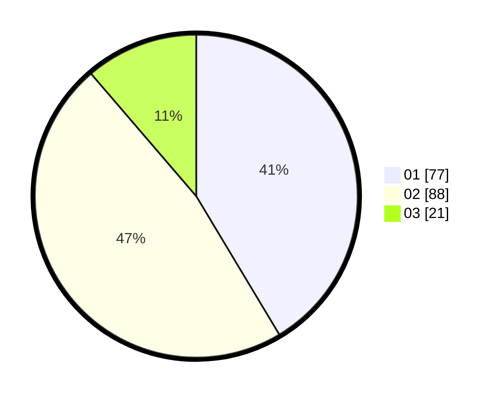

# Hasil

Hasil perolehan suara paslon dapat dilihat pada file paslon-01.txt, paslon-02.txt, dan paslon-03.txt.

Jika tidak ada, artinya data tersebut belum ada pada SIREKAP.

## Perolehan Suara

 * Paslon 01: **77**.
 * Paslon 02: **88**.
 * Paslon 03: **21**.

## Foto C Plano

https://sirekap-obj-formc.kpu.go.id/3c34/pemilu/ppwp/31/73/04/10/08/3173041008058-20240215-010557--0a111a41-1ffa-42da-87fa-1eb906073fe6.jpg

https://sirekap-obj-formc.kpu.go.id/3c34/pemilu/ppwp/31/73/04/10/08/3173041008058-20240215-010616--204dd453-88b3-48f1-b6ca-69ca6dc50ba1.jpg

https://sirekap-obj-formc.kpu.go.id/3c34/pemilu/ppwp/31/73/04/10/08/3173041008058-20240215-010631--05746716-0d3a-42f9-bb70-c5b85ce40787.jpg

## DATA PEMILIH TETAP

Jumlah pemilih dalam DPT: **265**.
 * L: **138**.
 * P: **127**.

## DATA PENGGUNA HAK PILIH

Jumlah pengguna hak pilih dalam DPT: **186**.
 * L: **100**.
 * P: **86**.

Jumlah pengguna hak pilih dalam DPTb: **3**.
 * L: **3**.
 * P: **0**.

Jumlah pengguna hak pilih dalam DPK: **1**.
 * L: **0**.
 * P: **1**.

Jumlah pengguna hak pilih: **190**.
 * L: **103**.
 * P: **87**.

## JUMLAH SUARA SAH DAN TIDAK SAH

JUMLAH SELURUH SUARA SAH: **186**.

JUMLAH SUARA TIDAK SAH: **4**.

JUMLAH SELURUH SUARA SAH DAN SUARA TIDAK SAH: **190**.
