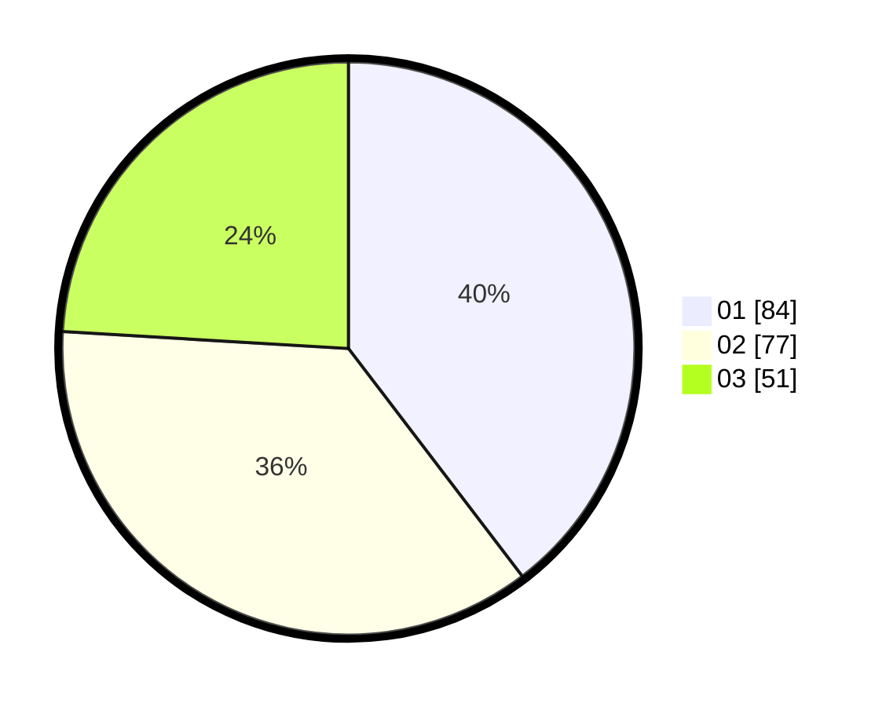

# Hasil

Hasil perolehan suara paslon dapat dilihat pada file paslon-01.txt, paslon-02.txt, dan paslon-03.txt.

Jika tidak ada, artinya data tersebut belum ada pada SIREKAP.

## Perolehan Suara

 * Paslon 01: **84**.
 * Paslon 02: **77**.
 * Paslon 03: **51**.

## Foto C Plano

https://sirekap-obj-formc.kpu.go.id/5e2d/pemilu/ppwp/31/73/04/10/08/3173041008060-20240214-190000--cc19f6b6-7770-4da6-a092-93034342569b.jpg

https://sirekap-obj-formc.kpu.go.id/5e2d/pemilu/ppwp/31/73/04/10/08/3173041008060-20240214-191115--ef8f97db-4d9a-40be-bc9a-bd4f0977ac32.jpg

https://sirekap-obj-formc.kpu.go.id/5e2d/pemilu/ppwp/31/73/04/10/08/3173041008060-20240214-201351--ade5a22a-0095-4859-93d2-7093aeceac5c.jpg
