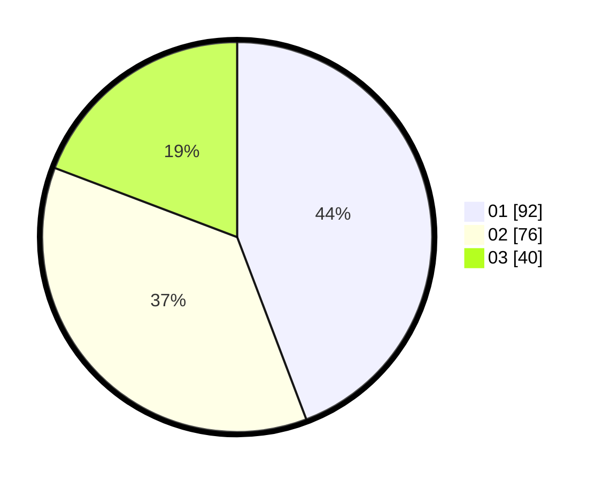

# Hasil

Hasil perolehan suara paslon dapat dilihat pada file paslon-01.txt, paslon-02.txt, dan paslon-03.txt.

Jika tidak ada, artinya data tersebut belum ada pada SIREKAP.

## Perolehan Suara

 * Paslon 01: **92**.
 * Paslon 02: **76**.
 * Paslon 03: **40**.

## Foto C Plano

https://sirekap-obj-formc.kpu.go.id/fd76/pemilu/ppwp/31/73/04/10/08/3173041008065-20240214-201259--38e24739-d2ef-4077-b35e-8297dae92483.jpg

https://sirekap-obj-formc.kpu.go.id/fd76/pemilu/ppwp/31/73/04/10/08/3173041008065-20240214-222406--fc3537ad-6ef8-445d-9c5b-e004e141c72d.jpg

https://sirekap-obj-formc.kpu.go.id/fd76/pemilu/ppwp/31/73/04/10/08/3173041008065-20240214-202305--c1fa4c2f-717f-42bd-a5c1-e6d67d7315d6.jpg

## DATA PEMILIH TETAP

Jumlah pemilih dalam DPT: **273**.
 * L: **139**.
 * P: **134**.

## DATA PENGGUNA HAK PILIH

Jumlah pengguna hak pilih dalam DPT: **209**.
 * L: **109**.
 * P: **100**.

Jumlah pengguna hak pilih dalam DPTb: **0**.
 * L: **0**.
 * P: **0**.

Jumlah pengguna hak pilih dalam DPK: **3**.
 * L: **2**.
 * P: **1**.

Jumlah pengguna hak pilih: **212**.
 * L: **111**.
 * P: **101**.

## JUMLAH SUARA SAH DAN TIDAK SAH

JUMLAH SELURUH SUARA SAH: **208**.

JUMLAH SUARA TIDAK SAH: **4**.

JUMLAH SELURUH SUARA SAH DAN SUARA TIDAK SAH: **212**.
