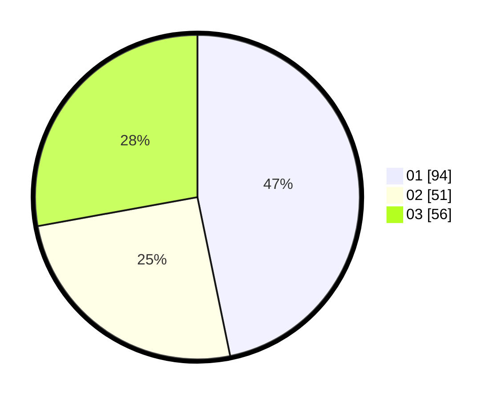

# Hasil

Hasil perolehan suara paslon dapat dilihat pada file paslon-01.txt, paslon-02.txt, dan paslon-03.txt.

Jika tidak ada, artinya data tersebut belum ada pada SIREKAP.

## Perolehan Suara

 * Paslon 01: **94**.
 * Paslon 02: **51**.
 * Paslon 03: **56**.

## Foto C Plano

https://sirekap-obj-formc.kpu.go.id/2528/pemilu/ppwp/31/73/04/10/08/3173041008066-20240214-195611--e19c8037-fe9f-428a-a9ac-b60ed15e57c1.jpg

https://sirekap-obj-formc.kpu.go.id/2528/pemilu/ppwp/31/73/04/10/08/3173041008066-20240214-212157--b8c7f132-0148-4a20-9e9a-321532d5f320.jpg

https://sirekap-obj-formc.kpu.go.id/2528/pemilu/ppwp/31/73/04/10/08/3173041008066-20240214-195649--0c0ffb45-c024-40a3-95c0-eba2ff4c610c.jpg
