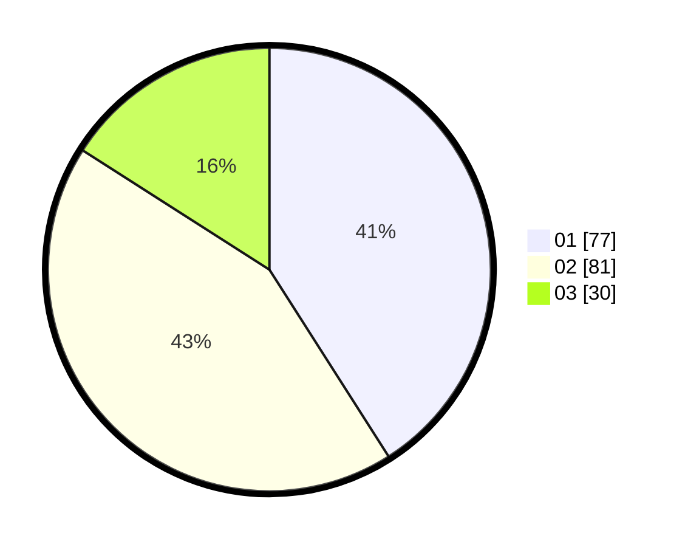

# Hasil

Hasil perolehan suara paslon dapat dilihat pada file paslon-01.txt, paslon-02.txt, dan paslon-03.txt.

Jika tidak ada, artinya data tersebut belum ada pada SIREKAP.

## Perolehan Suara

 * Paslon 01: **77**.
 * Paslon 02: **81**.
 * Paslon 03: **30**.

## Foto C Plano

https://sirekap-obj-formc.kpu.go.id/90fb/pemilu/ppwp/31/73/04/10/08/3173041008070-20240214-190104--69a7f06e-e53c-4a74-a894-4a999e6b7474.jpg

https://sirekap-obj-formc.kpu.go.id/90fb/pemilu/ppwp/31/73/04/10/08/3173041008070-20240214-190121--d3643d81-24aa-4efc-a419-d5907955a6ef.jpg

https://sirekap-obj-formc.kpu.go.id/90fb/pemilu/ppwp/31/73/04/10/08/3173041008070-20240214-190142--ca8cfadb-6168-488e-81e1-5c06e4fff991.jpg

## DATA PEMILIH TETAP

Jumlah pemilih dalam DPT: **281**.
 * L: **139**.
 * P: **142**.

## DATA PENGGUNA HAK PILIH

Jumlah pengguna hak pilih dalam DPT: **192**.
 * L: **96**.
 * P: **96**.

Jumlah pengguna hak pilih dalam DPTb: **0**.
 * L: **0**.
 * P: **0**.

Jumlah pengguna hak pilih dalam DPK: **0**.
 * L: **0**.
 * P: **0**.

Jumlah pengguna hak pilih: **192**.
 * L: **96**.
 * P: **96**.

## JUMLAH SUARA SAH DAN TIDAK SAH

JUMLAH SELURUH SUARA SAH: **188**.

JUMLAH SUARA TIDAK SAH: **4**.

JUMLAH SELURUH SUARA SAH DAN SUARA TIDAK SAH: **192**.
