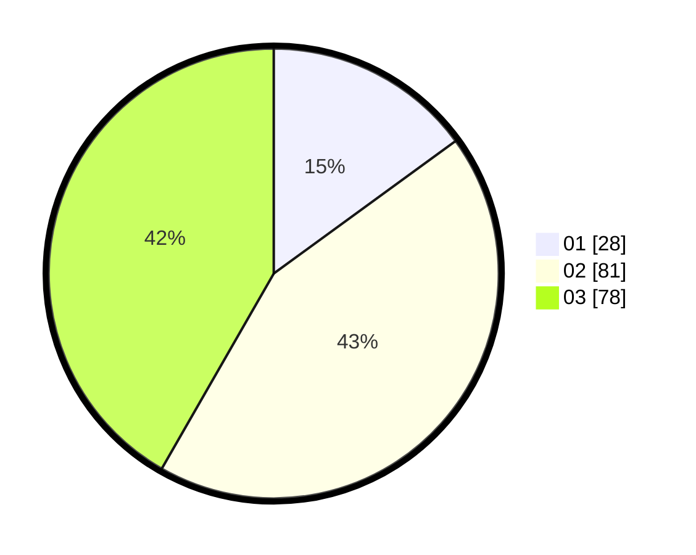

# Hasil

Hasil perolehan suara paslon dapat dilihat pada file paslon-01.txt, paslon-02.txt, dan paslon-03.txt.

Jika tidak ada, artinya data tersebut belum ada pada SIREKAP.

## Perolehan Suara

 * Paslon 01: **28**.
 * Paslon 02: **81**.
 * Paslon 03: **78**.

## Foto C Plano

https://sirekap-obj-formc.kpu.go.id/855d/pemilu/ppwp/31/73/04/10/08/3173041008072-20240214-184526--e05fecbb-b3c5-41c2-9ac0-e82a5e4887c7.jpg

https://sirekap-obj-formc.kpu.go.id/855d/pemilu/ppwp/31/73/04/10/08/3173041008072-20240214-184508--f761ba0b-b614-4a80-8b7d-d97d7496f1e7.jpg

https://sirekap-obj-formc.kpu.go.id/855d/pemilu/ppwp/31/73/04/10/08/3173041008072-20240214-184533--2bd6fff8-69b3-4623-9320-8d617c848cb1.jpg

## DATA PEMILIH TETAP

Jumlah pemilih dalam DPT: **222**.
 * L: **108**.
 * P: **114**.

## DATA PENGGUNA HAK PILIH

Jumlah pengguna hak pilih dalam DPT: **186**.
 * L: **89**.
 * P: **97**.

Jumlah pengguna hak pilih dalam DPTb: **0**.
 * L: **0**.
 * P: **0**.

Jumlah pengguna hak pilih dalam DPK: **2**.
 * L: **1**.
 * P: **1**.

Jumlah pengguna hak pilih: **188**.
 * L: **90**.
 * P: **98**.

## JUMLAH SUARA SAH DAN TIDAK SAH

JUMLAH SELURUH SUARA SAH: **187**.

JUMLAH SUARA TIDAK SAH: **1**.

JUMLAH SELURUH SUARA SAH DAN SUARA TIDAK SAH: **188**.
