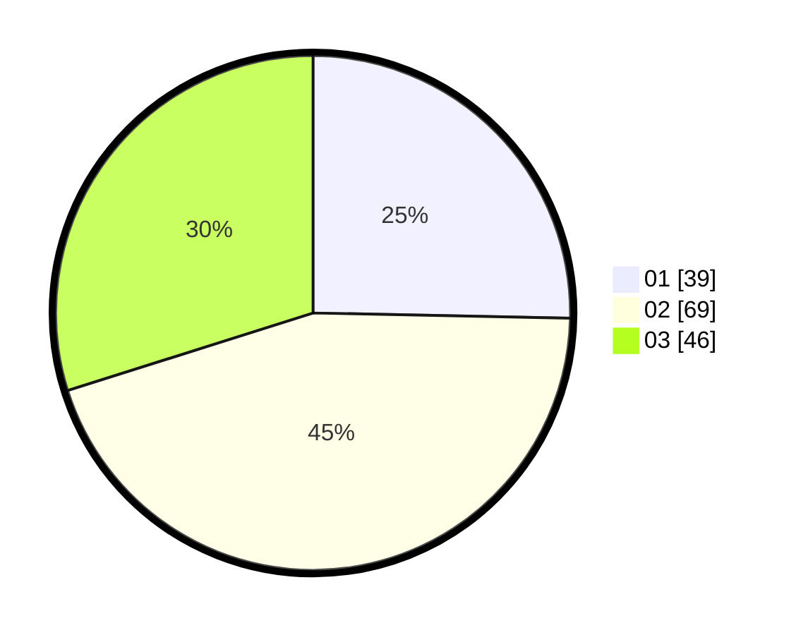

# Hasil

Hasil perolehan suara paslon dapat dilihat pada file paslon-01.txt, paslon-02.txt, dan paslon-03.txt.

Jika tidak ada, artinya data tersebut belum ada pada SIREKAP.

## Perolehan Suara

 * Paslon 01: **39**.
 * Paslon 02: **69**.
 * Paslon 03: **46**.

## Foto C Plano

https://sirekap-obj-formc.kpu.go.id/52c5/pemilu/ppwp/31/73/04/10/09/3173041009001-20240214-220912--66008732-2d58-4f5b-9ca6-519a146bc45f.jpg

https://sirekap-obj-formc.kpu.go.id/52c5/pemilu/ppwp/31/73/04/10/09/3173041009001-20240214-222945--e8b765b1-1e30-420d-963e-3fd0854fecf2.jpg

https://sirekap-obj-formc.kpu.go.id/52c5/pemilu/ppwp/31/73/04/10/09/3173041009001-20240214-223051--28eb0365-1c46-498d-ae46-25feb76e5742.jpg
