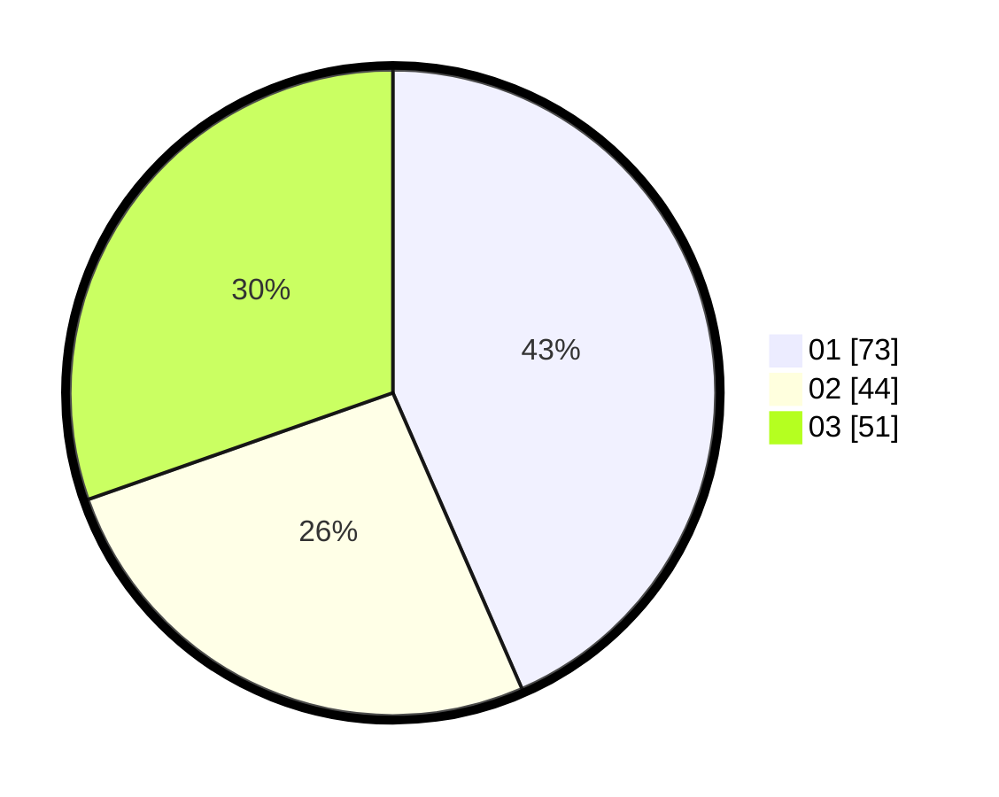

# Hasil

Hasil perolehan suara paslon dapat dilihat pada file paslon-01.txt, paslon-02.txt, dan paslon-03.txt.

Jika tidak ada, artinya data tersebut belum ada pada SIREKAP.

## Perolehan Suara

 * Paslon 01: **73**.
 * Paslon 02: **44**.
 * Paslon 03: **51**.

## Foto C Plano

https://sirekap-obj-formc.kpu.go.id/a07f/pemilu/ppwp/31/73/04/10/09/3173041009002-20240214-233626--b540a484-3d8a-42ff-a4f0-0475aba5185a.jpg

https://sirekap-obj-formc.kpu.go.id/a07f/pemilu/ppwp/31/73/04/10/09/3173041009002-20240214-233650--a0de427b-7434-4d2e-ae9a-af2f7dbcca0d.jpg

https://sirekap-obj-formc.kpu.go.id/a07f/pemilu/ppwp/31/73/04/10/09/3173041009002-20240214-233718--86b98fc7-010f-49c1-afa4-818619c8c124.jpg
