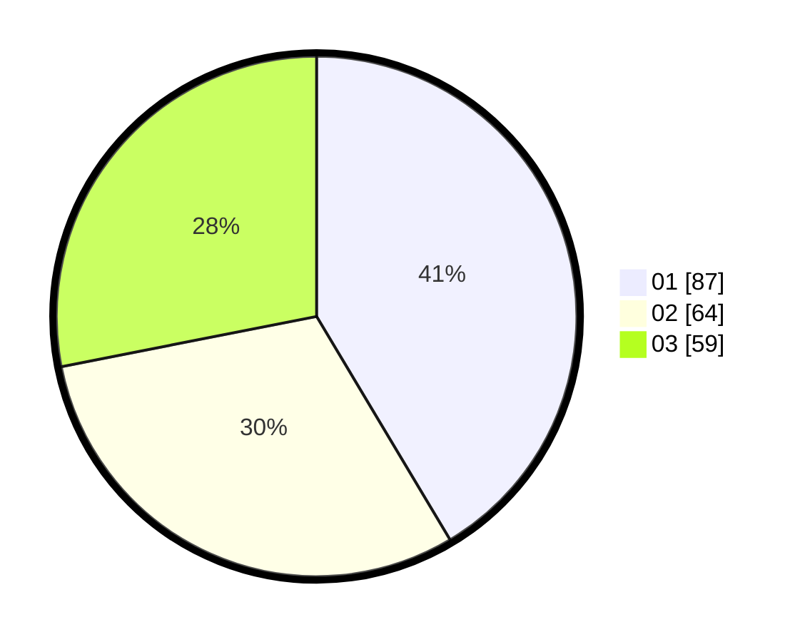

# Hasil

Hasil perolehan suara paslon dapat dilihat pada file paslon-01.txt, paslon-02.txt, dan paslon-03.txt.

Jika tidak ada, artinya data tersebut belum ada pada SIREKAP.

## Perolehan Suara

 * Paslon 01: **87**.
 * Paslon 02: **64**.
 * Paslon 03: **59**.

## Foto C Plano

https://sirekap-obj-formc.kpu.go.id/9380/pemilu/ppwp/31/73/04/10/09/3173041009005-20240214-155125--fd491ee1-db60-48df-94cc-cb94e2025929.jpg

https://sirekap-obj-formc.kpu.go.id/9380/pemilu/ppwp/31/73/04/10/09/3173041009005-20240214-193945--bf1c908c-35ec-45a4-aa1f-50b3006c2f1f.jpg
