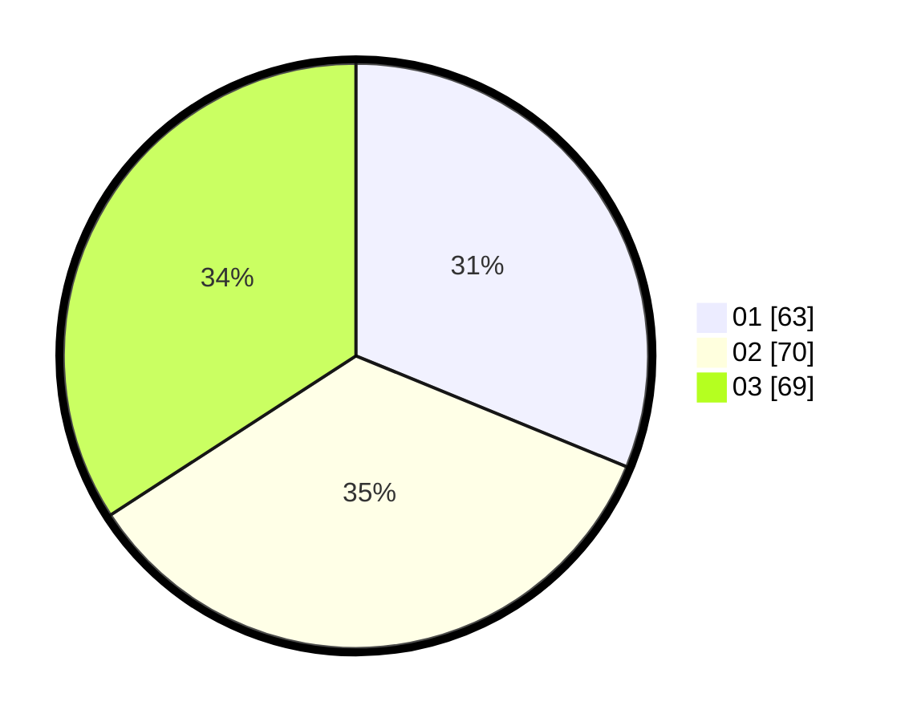

# Hasil

Hasil perolehan suara paslon dapat dilihat pada file paslon-01.txt, paslon-02.txt, dan paslon-03.txt.

Jika tidak ada, artinya data tersebut belum ada pada SIREKAP.

## Perolehan Suara

 * Paslon 01: **63**.
 * Paslon 02: **70**.
 * Paslon 03: **69**.

## Foto C Plano

https://sirekap-obj-formc.kpu.go.id/43ab/pemilu/ppwp/31/73/04/10/09/3173041009006-20240214-191923--ec1328f9-eebd-4923-94e0-b6141a73cca6.jpg

https://sirekap-obj-formc.kpu.go.id/43ab/pemilu/ppwp/31/73/04/10/09/3173041009006-20240214-191947--5977c3c9-86f1-480f-86e2-eada4b60fcdf.jpg

https://sirekap-obj-formc.kpu.go.id/43ab/pemilu/ppwp/31/73/04/10/09/3173041009006-20240214-191957--efa5a142-0f33-463d-8d9b-83d10c86c6e7.jpg

## DATA PEMILIH TETAP

Jumlah pemilih dalam DPT: **272**.
 * L: **130**.
 * P: **142**.

## DATA PENGGUNA HAK PILIH

Jumlah pengguna hak pilih dalam DPT: **205**.
 * L: **93**.
 * P: **112**.

Jumlah pengguna hak pilih dalam DPTb: **0**.
 * L: **0**.
 * P: **0**.

Jumlah pengguna hak pilih dalam DPK: **2**.
 * L: **2**.
 * P: **0**.

Jumlah pengguna hak pilih: **207**.
 * L: **95**.
 * P: **112**.

## JUMLAH SUARA SAH DAN TIDAK SAH

JUMLAH SELURUH SUARA SAH: **202**.

JUMLAH SUARA TIDAK SAH: **5**.

JUMLAH SELURUH SUARA SAH DAN SUARA TIDAK SAH: **207**.
