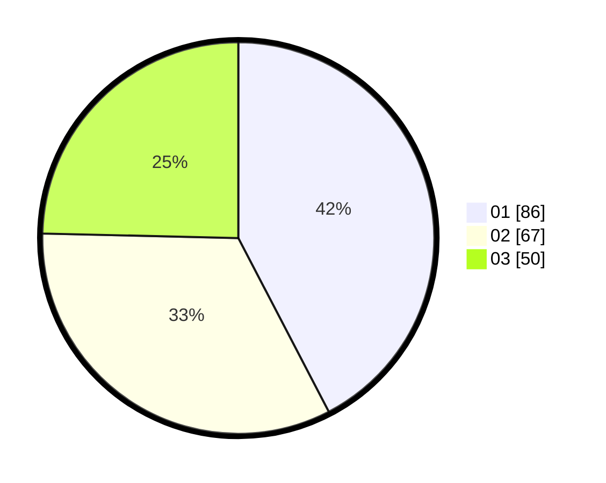

# Hasil

Hasil perolehan suara paslon dapat dilihat pada file paslon-01.txt, paslon-02.txt, dan paslon-03.txt.

Jika tidak ada, artinya data tersebut belum ada pada SIREKAP.

## Perolehan Suara

 * Paslon 01: **86**.
 * Paslon 02: **67**.
 * Paslon 03: **50**.

## Foto C Plano

https://sirekap-obj-formc.kpu.go.id/471e/pemilu/ppwp/31/73/04/10/09/3173041009007-20240215-010529--610c318c-3b31-4825-a5ab-f9b53fc1da63.jpg

https://sirekap-obj-formc.kpu.go.id/471e/pemilu/ppwp/31/73/04/10/09/3173041009007-20240215-010619--8e7e66b3-ef12-46a8-ba41-0e44506f363e.jpg

https://sirekap-obj-formc.kpu.go.id/471e/pemilu/ppwp/31/73/04/10/09/3173041009007-20240215-010710--1d606188-ac40-460b-9dc2-236a7e1cfee4.jpg
