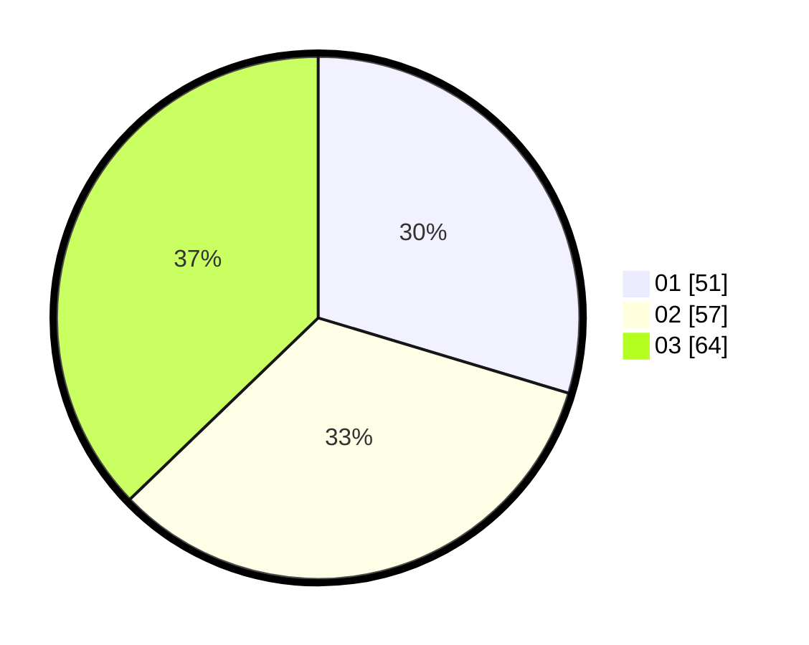

# Hasil

Hasil perolehan suara paslon dapat dilihat pada file paslon-01.txt, paslon-02.txt, dan paslon-03.txt.

Jika tidak ada, artinya data tersebut belum ada pada SIREKAP.

## Perolehan Suara

 * Paslon 01: **51**.
 * Paslon 02: **57**.
 * Paslon 03: **64**.

## Foto C Plano

https://sirekap-obj-formc.kpu.go.id/f541/pemilu/ppwp/31/73/04/10/09/3173041009010-20240214-230340--bf4143c8-569b-431f-b530-b8aa8e0ea005.jpg

https://sirekap-obj-formc.kpu.go.id/f541/pemilu/ppwp/31/73/04/10/09/3173041009010-20240214-230359--c3c90dd5-108c-4cd2-9d44-a18c3a564cfc.jpg

https://sirekap-obj-formc.kpu.go.id/f541/pemilu/ppwp/31/73/04/10/09/3173041009010-20240214-230424--a518d68c-f61e-4367-9d18-d2e574132bd4.jpg
