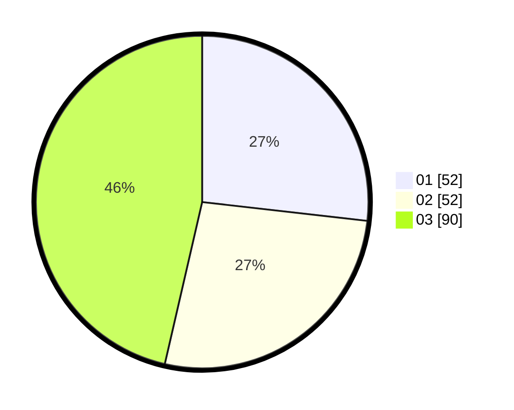

# Hasil

Hasil perolehan suara paslon dapat dilihat pada file paslon-01.txt, paslon-02.txt, dan paslon-03.txt.

Jika tidak ada, artinya data tersebut belum ada pada SIREKAP.

## Perolehan Suara

 * Paslon 01: **52**.
 * Paslon 02: **52**.
 * Paslon 03: **90**.

## Foto C Plano

https://sirekap-obj-formc.kpu.go.id/76cd/pemilu/ppwp/31/73/04/10/09/3173041009011-20240215-003203--95129a9c-5d58-4380-84a7-f5ac762e59c3.jpg

https://sirekap-obj-formc.kpu.go.id/76cd/pemilu/ppwp/31/73/04/10/09/3173041009011-20240215-003231--8195b959-99a6-48e3-9e90-8d68fbf5bfc6.jpg

https://sirekap-obj-formc.kpu.go.id/76cd/pemilu/ppwp/31/73/04/10/09/3173041009011-20240215-003248--4e11abaa-4024-4375-a2b7-819d6516ef54.jpg
