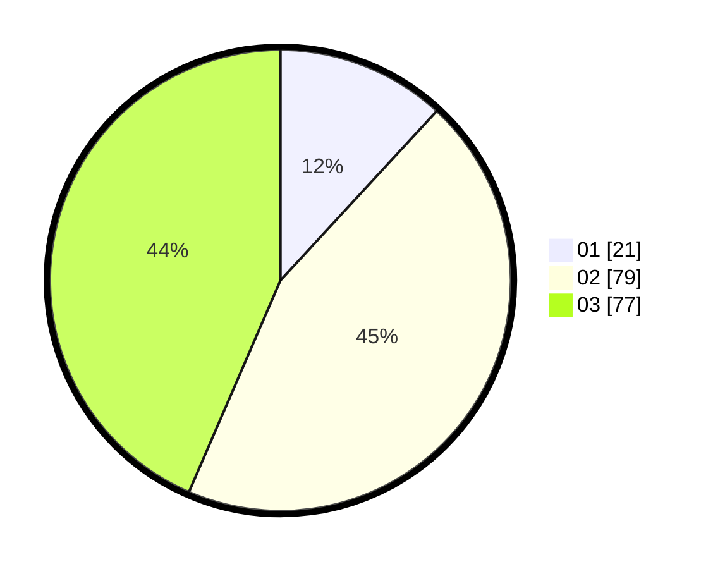

# Hasil

Hasil perolehan suara paslon dapat dilihat pada file paslon-01.txt, paslon-02.txt, dan paslon-03.txt.

Jika tidak ada, artinya data tersebut belum ada pada SIREKAP.

## Perolehan Suara

 * Paslon 01: **21**.
 * Paslon 02: **79**.
 * Paslon 03: **77**.

## Foto C Plano

https://sirekap-obj-formc.kpu.go.id/786b/pemilu/ppwp/31/73/04/10/09/3173041009015-20240214-213313--c99695dc-aa28-4a09-aaf6-8c0d96227c6b.jpg

https://sirekap-obj-formc.kpu.go.id/786b/pemilu/ppwp/31/73/04/10/09/3173041009015-20240214-213616--034a7198-6231-4dd5-82e9-24aeab963496.jpg

https://sirekap-obj-formc.kpu.go.id/786b/pemilu/ppwp/31/73/04/10/09/3173041009015-20240214-213834--f650a4ef-8162-4cb0-b915-8d29abb8f76d.jpg
