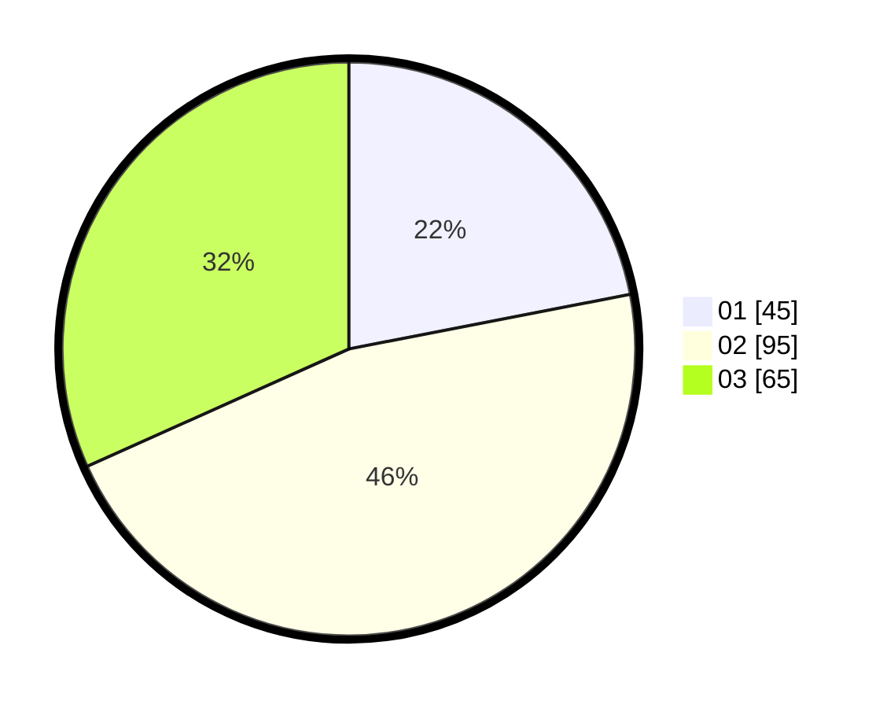

# Hasil

Hasil perolehan suara paslon dapat dilihat pada file paslon-01.txt, paslon-02.txt, dan paslon-03.txt.

Jika tidak ada, artinya data tersebut belum ada pada SIREKAP.

## Perolehan Suara

 * Paslon 01: **45**.
 * Paslon 02: **95**.
 * Paslon 03: **65**.

## Foto C Plano

https://sirekap-obj-formc.kpu.go.id/52a4/pemilu/ppwp/31/73/04/10/09/3173041009016-20240214-190729--759f8736-c034-4d56-9394-6cf09eec2a4e.jpg

https://sirekap-obj-formc.kpu.go.id/52a4/pemilu/ppwp/31/73/04/10/09/3173041009016-20240214-191109--201fc460-ebb6-42f4-8479-536c3cd2b3dd.jpg

https://sirekap-obj-formc.kpu.go.id/52a4/pemilu/ppwp/31/73/04/10/09/3173041009016-20240214-191002--5eaa0b1c-3cc1-464d-82fd-70e8a057e687.jpg

## DATA PEMILIH TETAP

Jumlah pemilih dalam DPT: **273**.
 * L: **142**.
 * P: **131**.

## DATA PENGGUNA HAK PILIH

Jumlah pengguna hak pilih dalam DPT: **210**.
 * L: **112**.
 * P: **98**.

Jumlah pengguna hak pilih dalam DPTb: **1**.
 * L: **1**.
 * P: **0**.

Jumlah pengguna hak pilih dalam DPK: **2**.
 * L: **1**.
 * P: **1**.

Jumlah pengguna hak pilih: **213**.
 * L: **114**.
 * P: **99**.

## JUMLAH SUARA SAH DAN TIDAK SAH

JUMLAH SELURUH SUARA SAH: **205**.

JUMLAH SUARA TIDAK SAH: **8**.

JUMLAH SELURUH SUARA SAH DAN SUARA TIDAK SAH: **213**.
