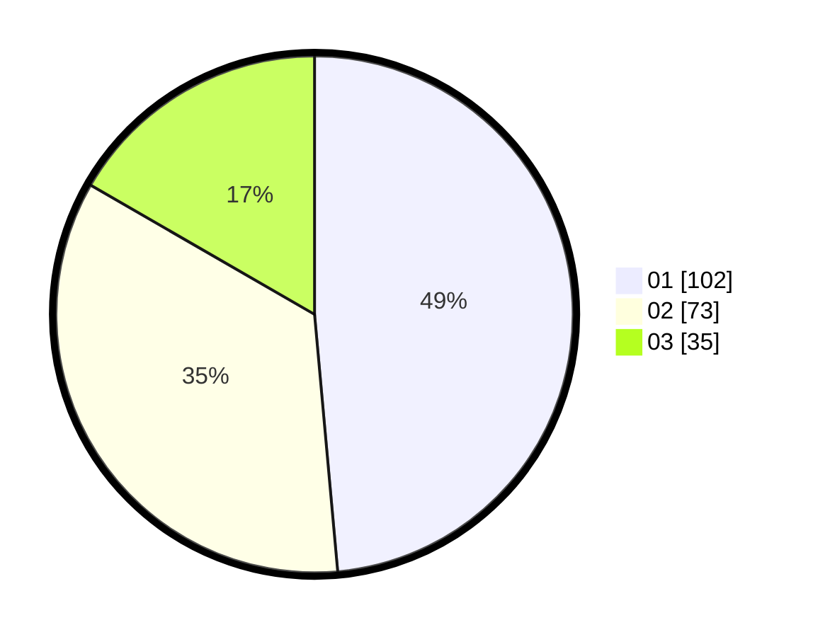

# Hasil

Hasil perolehan suara paslon dapat dilihat pada file paslon-01.txt, paslon-02.txt, dan paslon-03.txt.

Jika tidak ada, artinya data tersebut belum ada pada SIREKAP.

## Perolehan Suara

 * Paslon 01: **102**.
 * Paslon 02: **73**.
 * Paslon 03: **35**.

## Foto C Plano

https://sirekap-obj-formc.kpu.go.id/37bb/pemilu/ppwp/31/73/04/10/09/3173041009017-20240214-213510--5c2b91e6-411e-4fcb-9e12-7f4d82c1f9bd.jpg

https://sirekap-obj-formc.kpu.go.id/37bb/pemilu/ppwp/31/73/04/10/09/3173041009017-20240214-222444--b51ce3d4-f375-4f8f-a585-fbee164da60a.jpg

https://sirekap-obj-formc.kpu.go.id/37bb/pemilu/ppwp/31/73/04/10/09/3173041009017-20240214-200611--1f080405-7045-4794-a0aa-d8fb5b3abf1a.jpg
