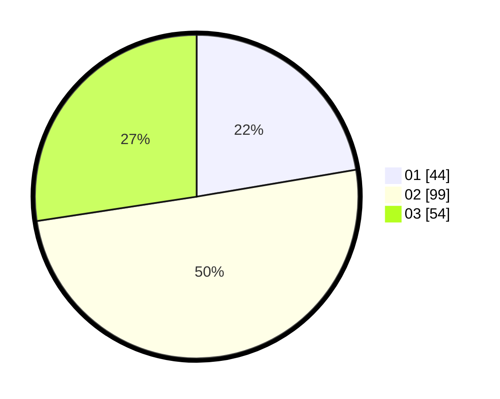

# Hasil

Hasil perolehan suara paslon dapat dilihat pada file paslon-01.txt, paslon-02.txt, dan paslon-03.txt.

Jika tidak ada, artinya data tersebut belum ada pada SIREKAP.

## Perolehan Suara

 * Paslon 01: **44**.
 * Paslon 02: **99**.
 * Paslon 03: **54**.

## Foto C Plano

https://sirekap-obj-formc.kpu.go.id/e5bc/pemilu/ppwp/31/73/04/10/09/3173041009019-20240214-200903--29aa6c14-c6f2-47d3-9e4d-954c50eb267a.jpg

https://sirekap-obj-formc.kpu.go.id/e5bc/pemilu/ppwp/31/73/04/10/09/3173041009019-20240214-200917--2ea7a258-87a0-43ef-b465-1e202322f513.jpg

https://sirekap-obj-formc.kpu.go.id/e5bc/pemilu/ppwp/31/73/04/10/09/3173041009019-20240214-200925--1ac1e0fc-aa5d-43cf-9441-90bdbe3b0934.jpg

## DATA PEMILIH TETAP

Jumlah pemilih dalam DPT: **271**.
 * L: **131**.
 * P: **140**.

## DATA PENGGUNA HAK PILIH

Jumlah pengguna hak pilih dalam DPT: **201**.
 * L: **45**.
 * P: **105**.

Jumlah pengguna hak pilih dalam DPTb: **0**.
 * L: **0**.
 * P: **0**.

Jumlah pengguna hak pilih dalam DPK: **2**.
 * L: **0**.
 * P: **2**.

Jumlah pengguna hak pilih: **207**.
 * L: **55**.
 * P: **100**.

## JUMLAH SUARA SAH DAN TIDAK SAH

JUMLAH SELURUH SUARA SAH: **147**.

JUMLAH SUARA TIDAK SAH: **5**.

JUMLAH SELURUH SUARA SAH DAN SUARA TIDAK SAH: **152**.
