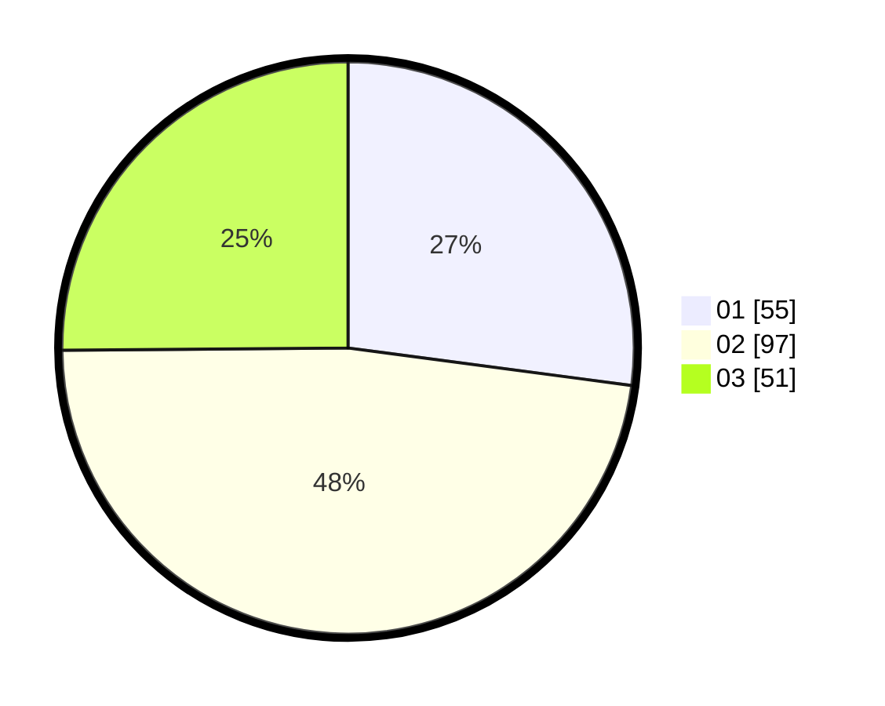

# Hasil

Hasil perolehan suara paslon dapat dilihat pada file paslon-01.txt, paslon-02.txt, dan paslon-03.txt.

Jika tidak ada, artinya data tersebut belum ada pada SIREKAP.

## Perolehan Suara

 * Paslon 01: **55**.
 * Paslon 02: **97**.
 * Paslon 03: **51**.

## Foto C Plano

https://sirekap-obj-formc.kpu.go.id/dd03/pemilu/ppwp/31/73/04/10/09/3173041009024-20240214-201301--57c84d43-ba69-4f46-8e20-dc275c7f90cd.jpg

https://sirekap-obj-formc.kpu.go.id/dd03/pemilu/ppwp/31/73/04/10/09/3173041009024-20240214-201516--094a9410-b4a7-4028-802c-5df590c79568.jpg

https://sirekap-obj-formc.kpu.go.id/dd03/pemilu/ppwp/31/73/04/10/09/3173041009024-20240214-201629--b555e5e5-db05-4249-90b3-5f0330e036a2.jpg

## DATA PEMILIH TETAP

Jumlah pemilih dalam DPT: **273**.
 * L: **146**.
 * P: **127**.

## DATA PENGGUNA HAK PILIH

Jumlah pengguna hak pilih dalam DPT: **198**.
 * L: **101**.
 * P: **97**.

Jumlah pengguna hak pilih dalam DPTb: **0**.
 * L: **0**.
 * P: **0**.

Jumlah pengguna hak pilih dalam DPK: **5**.
 * L: **2**.
 * P: **3**.

Jumlah pengguna hak pilih: **203**.
 * L: **103**.
 * P: **100**.

## JUMLAH SUARA SAH DAN TIDAK SAH

JUMLAH SELURUH SUARA SAH: **199**.

JUMLAH SUARA TIDAK SAH: **4**.

JUMLAH SELURUH SUARA SAH DAN SUARA TIDAK SAH: **203**.
