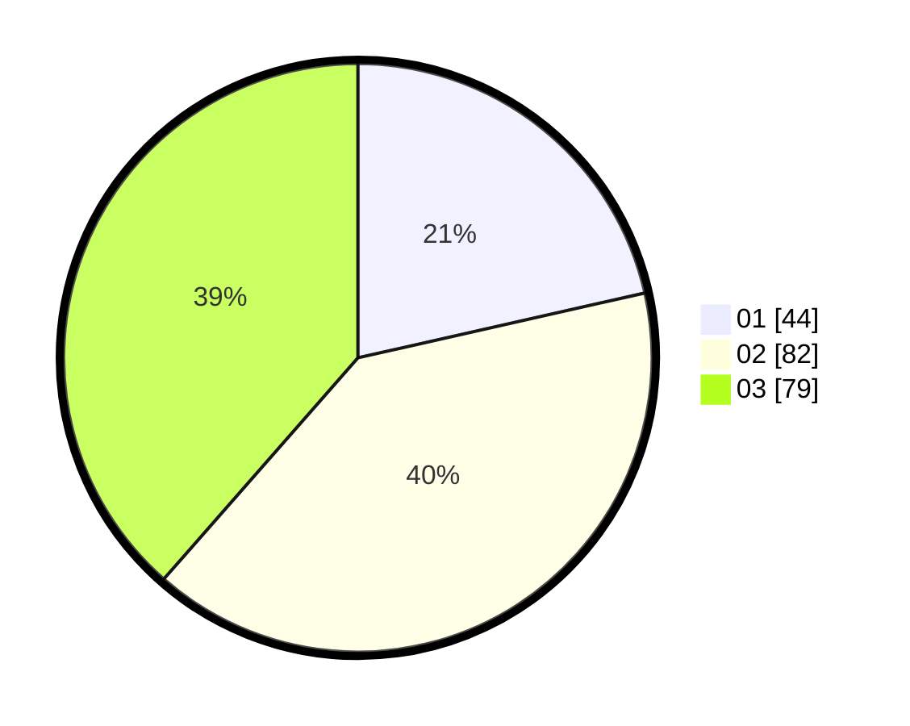

# Hasil

Hasil perolehan suara paslon dapat dilihat pada file paslon-01.txt, paslon-02.txt, dan paslon-03.txt.

Jika tidak ada, artinya data tersebut belum ada pada SIREKAP.

## Perolehan Suara

 * Paslon 01: **44**.
 * Paslon 02: **82**.
 * Paslon 03: **79**.

## Foto C Plano

https://sirekap-obj-formc.kpu.go.id/cb61/pemilu/ppwp/31/73/04/10/09/3173041009025-20240215-005529--68fb834b-076d-4f14-bbd6-36ba400899e5.jpg

https://sirekap-obj-formc.kpu.go.id/cb61/pemilu/ppwp/31/73/04/10/09/3173041009025-20240214-230612--c8db2a44-cbb2-4bfc-86ac-2a82e6201c64.jpg

https://sirekap-obj-formc.kpu.go.id/cb61/pemilu/ppwp/31/73/04/10/09/3173041009025-20240214-215010--8f5e8147-4b58-4dd8-95e1-ff61d4d0b930.jpg
