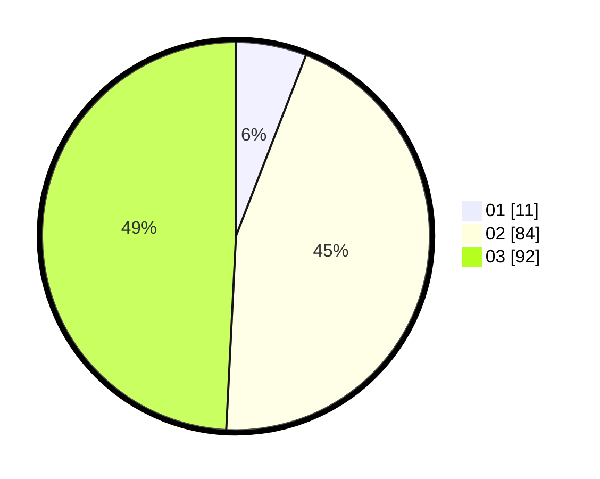

# Hasil

Hasil perolehan suara paslon dapat dilihat pada file paslon-01.txt, paslon-02.txt, dan paslon-03.txt.

Jika tidak ada, artinya data tersebut belum ada pada SIREKAP.

## Perolehan Suara

 * Paslon 01: **11**.
 * Paslon 02: **84**.
 * Paslon 03: **92**.

## Foto C Plano

https://sirekap-obj-formc.kpu.go.id/a923/pemilu/ppwp/31/73/04/10/09/3173041009027-20240215-024745--1545adb0-ecf6-4774-925a-2adf9559228b.jpg

https://sirekap-obj-formc.kpu.go.id/a923/pemilu/ppwp/31/73/04/10/09/3173041009027-20240215-024915--12984fc2-c965-4512-8e2b-8c963980f5dd.jpg

https://sirekap-obj-formc.kpu.go.id/a923/pemilu/ppwp/31/73/04/10/09/3173041009027-20240215-025006--038b41e4-261b-4de6-a94d-0ca3c34452f0.jpg
