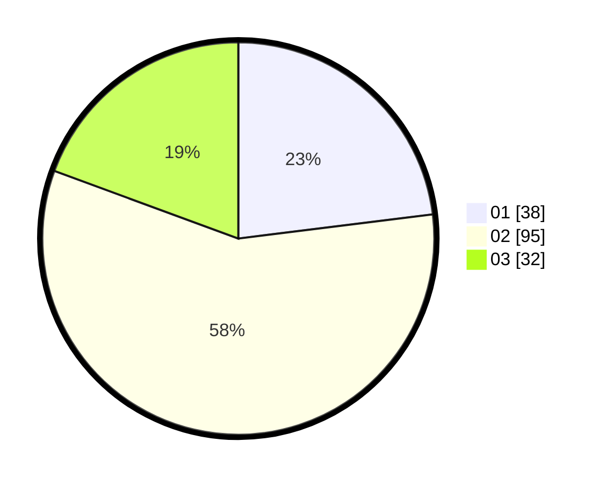

# Hasil

Hasil perolehan suara paslon dapat dilihat pada file paslon-01.txt, paslon-02.txt, dan paslon-03.txt.

Jika tidak ada, artinya data tersebut belum ada pada SIREKAP.

## Perolehan Suara

 * Paslon 01: **38**.
 * Paslon 02: **95**.
 * Paslon 03: **32**.

## Foto C Plano

https://sirekap-obj-formc.kpu.go.id/59d2/pemilu/ppwp/31/73/04/10/09/3173041009031-20240214-201052--90027498-b635-4d9e-92de-0d17cae5c551.jpg

https://sirekap-obj-formc.kpu.go.id/59d2/pemilu/ppwp/31/73/04/10/09/3173041009031-20240215-012243--419a7f71-2fa7-403a-a772-a579b6708ab0.jpg

https://sirekap-obj-formc.kpu.go.id/59d2/pemilu/ppwp/31/73/04/10/09/3173041009031-20240215-012334--8ee29459-742d-43df-b4b7-23548d7da777.jpg

## DATA PEMILIH TETAP

Jumlah pemilih dalam DPT: **223**.
 * L: **118**.
 * P: **105**.

## DATA PENGGUNA HAK PILIH

Jumlah pengguna hak pilih dalam DPT: **168**.
 * L: **86**.
 * P: **82**.

Jumlah pengguna hak pilih dalam DPTb: **2**.
 * L: **1**.
 * P: **1**.

Jumlah pengguna hak pilih dalam DPK: **0**.
 * L: **0**.
 * P: **0**.

Jumlah pengguna hak pilih: **170**.
 * L: **87**.
 * P: **83**.

## JUMLAH SUARA SAH DAN TIDAK SAH

JUMLAH SELURUH SUARA SAH: **165**.

JUMLAH SUARA TIDAK SAH: **5**.

JUMLAH SELURUH SUARA SAH DAN SUARA TIDAK SAH: **170**.
