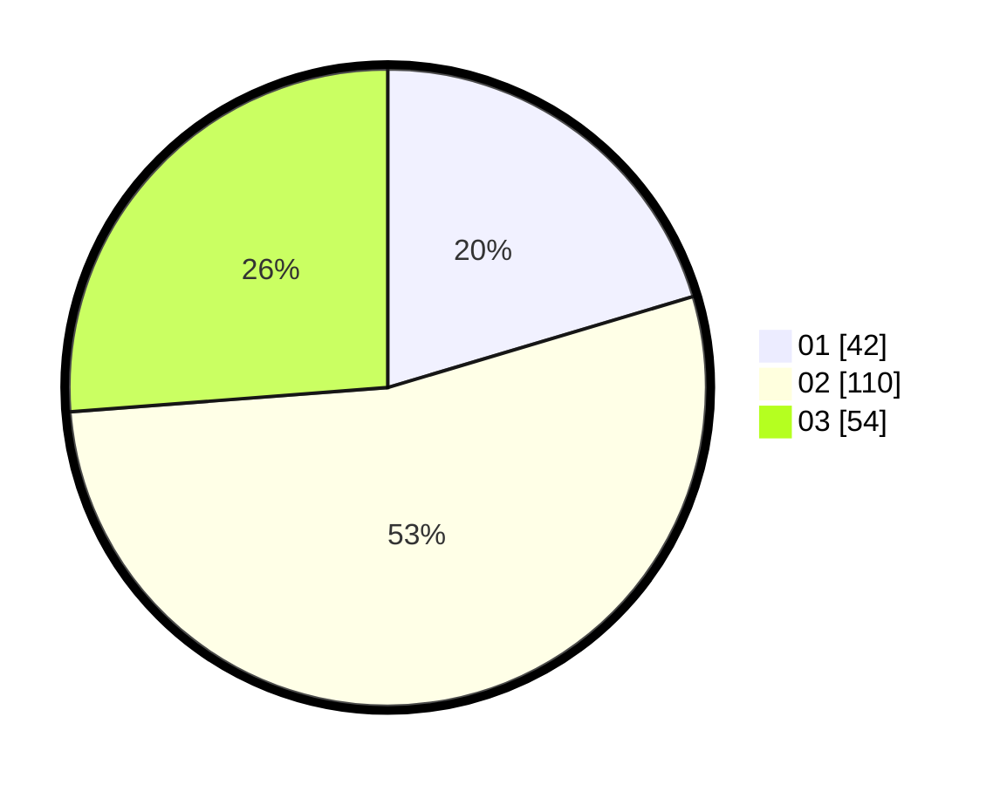

# Hasil

Hasil perolehan suara paslon dapat dilihat pada file paslon-01.txt, paslon-02.txt, dan paslon-03.txt.

Jika tidak ada, artinya data tersebut belum ada pada SIREKAP.

## Perolehan Suara

 * Paslon 01: **42**.
 * Paslon 02: **110**.
 * Paslon 03: **54**.

## Foto C Plano

https://sirekap-obj-formc.kpu.go.id/c406/pemilu/ppwp/31/73/04/10/09/3173041009033-20240216-132355--3b8783d4-ba4c-4b21-8dfd-dfc026842f98.jpg

https://sirekap-obj-formc.kpu.go.id/c406/pemilu/ppwp/31/73/04/10/09/3173041009033-20240216-132356--6ba59c51-fcac-4c20-885d-4cfe458b54a6.jpg

https://sirekap-obj-formc.kpu.go.id/c406/pemilu/ppwp/31/73/04/10/09/3173041009033-20240216-132356--e8dd7fa4-e99c-4a4c-95ab-5dbb574fa080.jpg

## DATA PEMILIH TETAP

Jumlah pemilih dalam DPT: **276**.
 * L: **137**.
 * P: **139**.

## DATA PENGGUNA HAK PILIH

Jumlah pengguna hak pilih dalam DPT: **210**.
 * L: **105**.
 * P: **105**.

Jumlah pengguna hak pilih dalam DPTb: **3**.
 * L: **0**.
 * P: **3**.

Jumlah pengguna hak pilih dalam DPK: **5**.
 * L: **1**.
 * P: **4**.

Jumlah pengguna hak pilih: **218**.
 * L: **106**.
 * P: **112**.

## JUMLAH SUARA SAH DAN TIDAK SAH

JUMLAH SELURUH SUARA SAH: **206**.

JUMLAH SUARA TIDAK SAH: **4**.

JUMLAH SELURUH SUARA SAH DAN SUARA TIDAK SAH: **210**.
