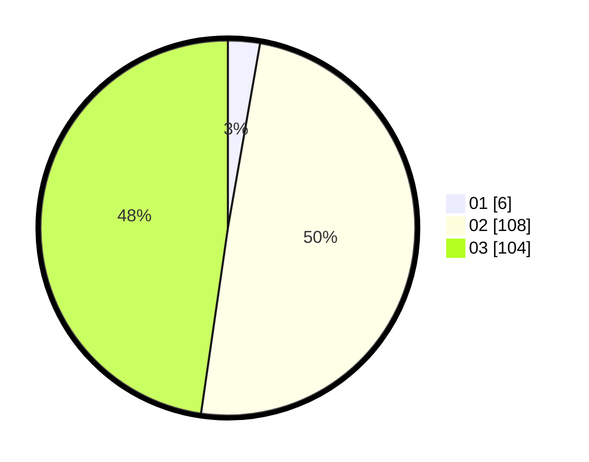

# Hasil

Hasil perolehan suara paslon dapat dilihat pada file paslon-01.txt, paslon-02.txt, dan paslon-03.txt.

Jika tidak ada, artinya data tersebut belum ada pada SIREKAP.

## Perolehan Suara

 * Paslon 01: **6**.
 * Paslon 02: **108**.
 * Paslon 03: **104**.

## Foto C Plano

https://sirekap-obj-formc.kpu.go.id/25f0/pemilu/ppwp/31/73/04/10/09/3173041009034-20240214-232553--65cbc844-f6ef-4e6f-a4b6-2bea0901f348.jpg

https://sirekap-obj-formc.kpu.go.id/25f0/pemilu/ppwp/31/73/04/10/09/3173041009034-20240214-155811--91703767-e55c-47ad-92bf-976356a142c9.jpg

https://sirekap-obj-formc.kpu.go.id/25f0/pemilu/ppwp/31/73/04/10/09/3173041009034-20240214-225712--1980e485-af98-45dc-abde-2cb9c7763741.jpg
