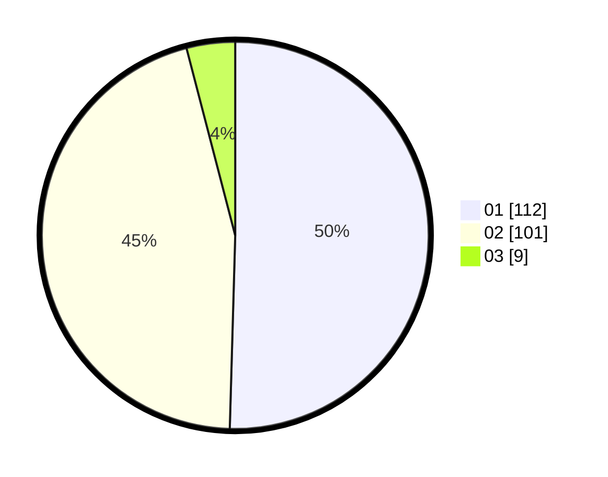

# Hasil

Hasil perolehan suara paslon dapat dilihat pada file paslon-01.txt, paslon-02.txt, dan paslon-03.txt.

Jika tidak ada, artinya data tersebut belum ada pada SIREKAP.

## Perolehan Suara

 * Paslon 01: **112**.
 * Paslon 02: **101**.
 * Paslon 03: **9**.

## Foto C Plano

https://sirekap-obj-formc.kpu.go.id/08b0/pemilu/ppwp/31/73/04/10/09/3173041009041-20240215-010814--0008d1cd-a8ff-4d4b-8eb0-afc9aa73f188.jpg

https://sirekap-obj-formc.kpu.go.id/08b0/pemilu/ppwp/31/73/04/10/09/3173041009041-20240215-011036--75476d03-12ca-4236-9010-48d9af0884cf.jpg

https://sirekap-obj-formc.kpu.go.id/08b0/pemilu/ppwp/31/73/04/10/09/3173041009041-20240215-011205--ead300f8-3d93-480d-82ae-72d05e3e4107.jpg
