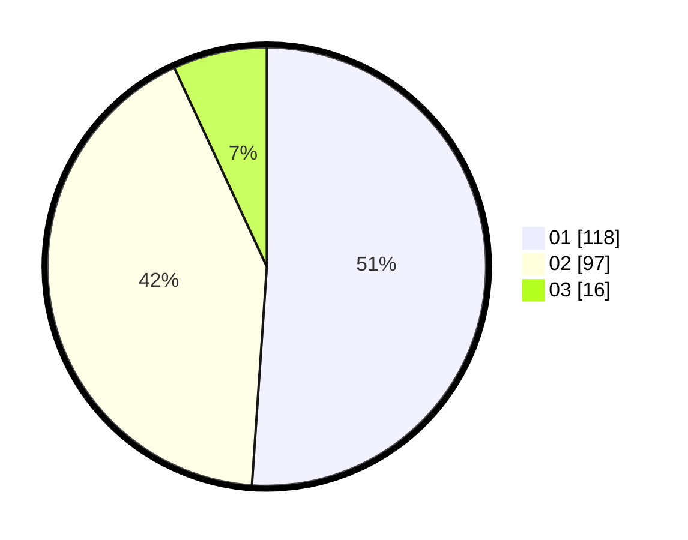

# Hasil

Hasil perolehan suara paslon dapat dilihat pada file paslon-01.txt, paslon-02.txt, dan paslon-03.txt.

Jika tidak ada, artinya data tersebut belum ada pada SIREKAP.

## Perolehan Suara

 * Paslon 01: **118**.
 * Paslon 02: **97**.
 * Paslon 03: **16**.

## Foto C Plano

https://sirekap-obj-formc.kpu.go.id/4934/pemilu/ppwp/31/73/04/10/09/3173041009042-20240214-195344--4b48c55f-1164-4c08-a1ea-870ee0a1a65b.jpg

https://sirekap-obj-formc.kpu.go.id/4934/pemilu/ppwp/31/73/04/10/09/3173041009042-20240214-195354--d12827f6-3e41-44a2-9537-12ed7338fb2e.jpg

https://sirekap-obj-formc.kpu.go.id/4934/pemilu/ppwp/31/73/04/10/09/3173041009042-20240214-195359--e9b5bf2c-803f-4abf-8edd-827d8be83a18.jpg

## DATA PEMILIH TETAP

Jumlah pemilih dalam DPT: **281**.
 * L: **137**.
 * P: **144**.

## DATA PENGGUNA HAK PILIH

Jumlah pengguna hak pilih dalam DPT: **225**.
 * L: **109**.
 * P: **116**.

Jumlah pengguna hak pilih dalam DPTb: **0**.
 * L: **0**.
 * P: **0**.

Jumlah pengguna hak pilih dalam DPK: **5**.
 * L: **1**.
 * P: **5**.

Jumlah pengguna hak pilih: **231**.
 * L: **110**.
 * P: **121**.

## JUMLAH SUARA SAH DAN TIDAK SAH

JUMLAH SELURUH SUARA SAH: **231**.

JUMLAH SUARA TIDAK SAH: **0**.

JUMLAH SELURUH SUARA SAH DAN SUARA TIDAK SAH: **231**.
