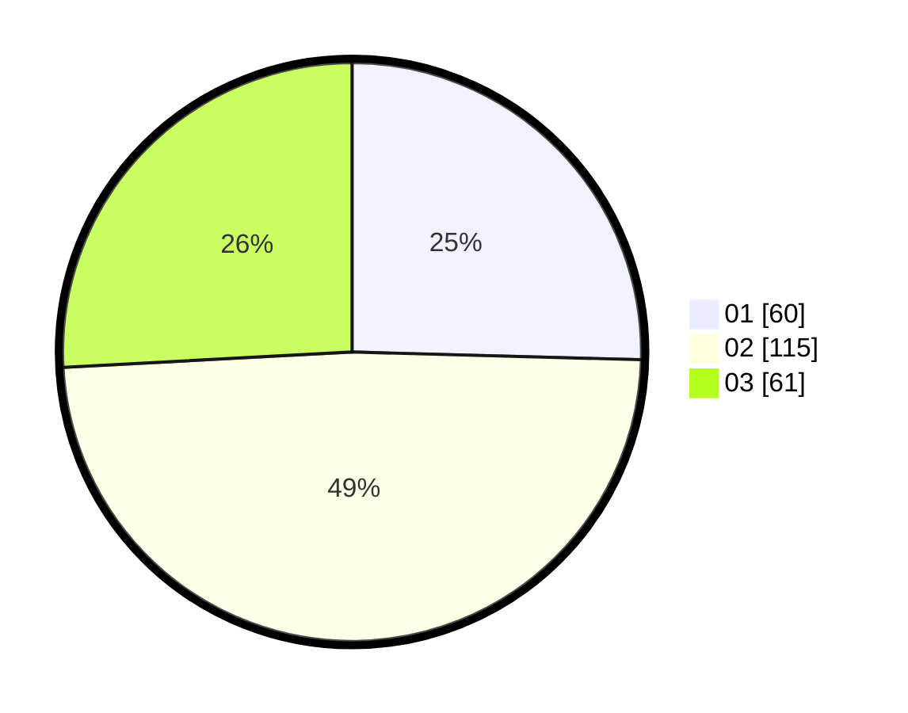

# Hasil

Hasil perolehan suara paslon dapat dilihat pada file paslon-01.txt, paslon-02.txt, dan paslon-03.txt.

Jika tidak ada, artinya data tersebut belum ada pada SIREKAP.

## Perolehan Suara

 * Paslon 01: **60**.
 * Paslon 02: **115**.
 * Paslon 03: **61**.

## Foto C Plano

https://sirekap-obj-formc.kpu.go.id/7961/pemilu/ppwp/31/73/04/10/09/3173041009047-20240215-053654--b5aacb46-db6c-4142-8b1f-e6a3ae952e45.jpg

https://sirekap-obj-formc.kpu.go.id/7961/pemilu/ppwp/31/73/04/10/09/3173041009047-20240215-053729--d11b1953-f7f0-4a81-b1e3-72da30bd583a.jpg

https://sirekap-obj-formc.kpu.go.id/7961/pemilu/ppwp/31/73/04/10/09/3173041009047-20240215-053842--fcf6251e-4e18-4a53-af87-aea6e4d7c787.jpg
