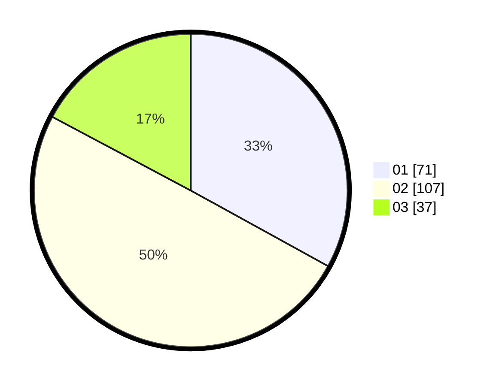

# Hasil

Hasil perolehan suara paslon dapat dilihat pada file paslon-01.txt, paslon-02.txt, dan paslon-03.txt.

Jika tidak ada, artinya data tersebut belum ada pada SIREKAP.

## Perolehan Suara

 * Paslon 01: **71**.
 * Paslon 02: **107**.
 * Paslon 03: **37**.

## Foto C Plano

https://sirekap-obj-formc.kpu.go.id/7a60/pemilu/ppwp/31/73/04/10/09/3173041009054-20240215-002948--c507ed32-11dd-437d-9124-f13cf4794711.jpg

https://sirekap-obj-formc.kpu.go.id/7a60/pemilu/ppwp/31/73/04/10/09/3173041009054-20240215-003125--8d17888c-d1e1-4f6b-9c81-fe15fe6a01df.jpg

https://sirekap-obj-formc.kpu.go.id/7a60/pemilu/ppwp/31/73/04/10/09/3173041009054-20240215-003257--beafc92b-eb93-4bd1-9bbe-04fcecc06e7a.jpg
