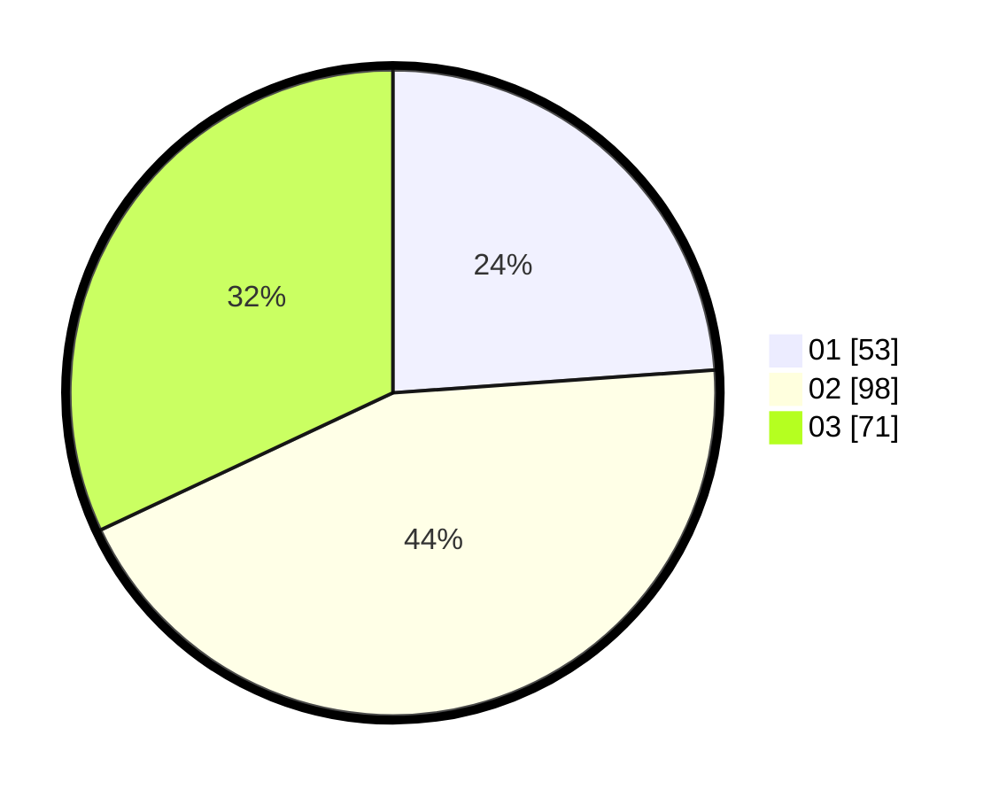

# Hasil

Hasil perolehan suara paslon dapat dilihat pada file paslon-01.txt, paslon-02.txt, dan paslon-03.txt.

Jika tidak ada, artinya data tersebut belum ada pada SIREKAP.

## Perolehan Suara

 * Paslon 01: **53**.
 * Paslon 02: **98**.
 * Paslon 03: **71**.

## Foto C Plano

https://sirekap-obj-formc.kpu.go.id/2cba/pemilu/ppwp/31/73/04/10/09/3173041009055-20240214-233635--74db18a7-ccdd-41c4-bd8d-73d2c05d6b19.jpg

https://sirekap-obj-formc.kpu.go.id/2cba/pemilu/ppwp/31/73/04/10/09/3173041009055-20240214-234028--0c87c894-15ba-4df2-8115-fa99f62dec39.jpg

https://sirekap-obj-formc.kpu.go.id/2cba/pemilu/ppwp/31/73/04/10/09/3173041009055-20240214-234258--4919928b-8e14-4275-b237-b8496c309925.jpg
