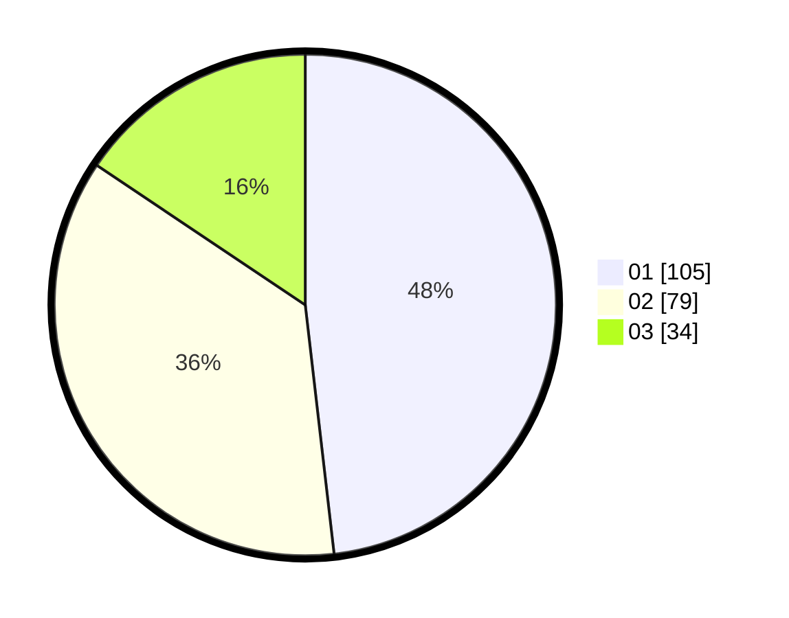

# Hasil

Hasil perolehan suara paslon dapat dilihat pada file paslon-01.txt, paslon-02.txt, dan paslon-03.txt.

Jika tidak ada, artinya data tersebut belum ada pada SIREKAP.

## Perolehan Suara

 * Paslon 01: **105**.
 * Paslon 02: **79**.
 * Paslon 03: **34**.

## Foto C Plano

https://sirekap-obj-formc.kpu.go.id/ca28/pemilu/ppwp/31/73/04/10/09/3173041009056-20240215-234037--2d2b8955-ff64-47a9-929a-1439438627e6.jpg

https://sirekap-obj-formc.kpu.go.id/ca28/pemilu/ppwp/31/73/04/10/09/3173041009056-20240214-194439--dc29653d-f0bd-4e63-9d88-ca82b7616e5b.jpg

https://sirekap-obj-formc.kpu.go.id/ca28/pemilu/ppwp/31/73/04/10/09/3173041009056-20240214-194913--b4925404-c67b-48ab-823c-388cd13a497b.jpg

## DATA PEMILIH TETAP

Jumlah pemilih dalam DPT: **251**.
 * L: **128**.
 * P: **123**.

## DATA PENGGUNA HAK PILIH

Jumlah pengguna hak pilih dalam DPT: **221**.
 * L: **109**.
 * P: **112**.

Jumlah pengguna hak pilih dalam DPTb: **2**.
 * L: **1**.
 * P: **1**.

Jumlah pengguna hak pilih dalam DPK: **1**.
 * L: **1**.
 * P: **0**.

Jumlah pengguna hak pilih: **224**.
 * L: **111**.
 * P: **113**.

## JUMLAH SUARA SAH DAN TIDAK SAH

JUMLAH SELURUH SUARA SAH: **218**.

JUMLAH SUARA TIDAK SAH: **6**.

JUMLAH SELURUH SUARA SAH DAN SUARA TIDAK SAH: **224**.
