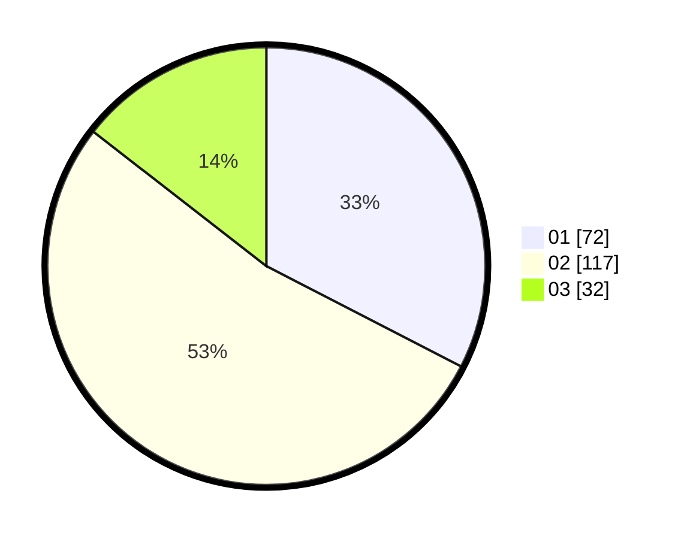

# Hasil

Hasil perolehan suara paslon dapat dilihat pada file paslon-01.txt, paslon-02.txt, dan paslon-03.txt.

Jika tidak ada, artinya data tersebut belum ada pada SIREKAP.

## Perolehan Suara

 * Paslon 01: **72**.
 * Paslon 02: **117**.
 * Paslon 03: **32**.

## Foto C Plano

https://sirekap-obj-formc.kpu.go.id/a1e0/pemilu/ppwp/31/73/04/10/09/3173041009057-20240215-000116--e3122bcc-ea57-4a10-a0c1-9940680f089f.jpg

https://sirekap-obj-formc.kpu.go.id/a1e0/pemilu/ppwp/31/73/04/10/09/3173041009057-20240214-232703--aea47dd1-e23c-4e8a-af46-0e146e7f6a87.jpg

https://sirekap-obj-formc.kpu.go.id/a1e0/pemilu/ppwp/31/73/04/10/09/3173041009057-20240215-003215--b6863eb5-b164-4baf-a18f-9afd92062b89.jpg
