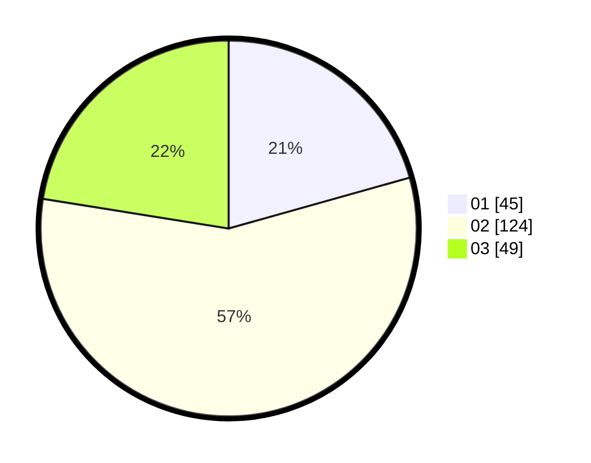

# Hasil

Hasil perolehan suara paslon dapat dilihat pada file paslon-01.txt, paslon-02.txt, dan paslon-03.txt.

Jika tidak ada, artinya data tersebut belum ada pada SIREKAP.

## Perolehan Suara

 * Paslon 01: **45**.
 * Paslon 02: **124**.
 * Paslon 03: **49**.

## Foto C Plano

https://sirekap-obj-formc.kpu.go.id/3fcf/pemilu/ppwp/31/73/04/10/09/3173041009059-20240214-232420--67e46482-3f71-4756-9145-103d82867afb.jpg

https://sirekap-obj-formc.kpu.go.id/3fcf/pemilu/ppwp/31/73/04/10/09/3173041009059-20240214-224304--6c5503a5-95ff-4649-924b-172412b52f91.jpg

https://sirekap-obj-formc.kpu.go.id/3fcf/pemilu/ppwp/31/73/04/10/09/3173041009059-20240214-224436--e28c477f-9c02-4a8b-b1a8-e6d61f7b4395.jpg
