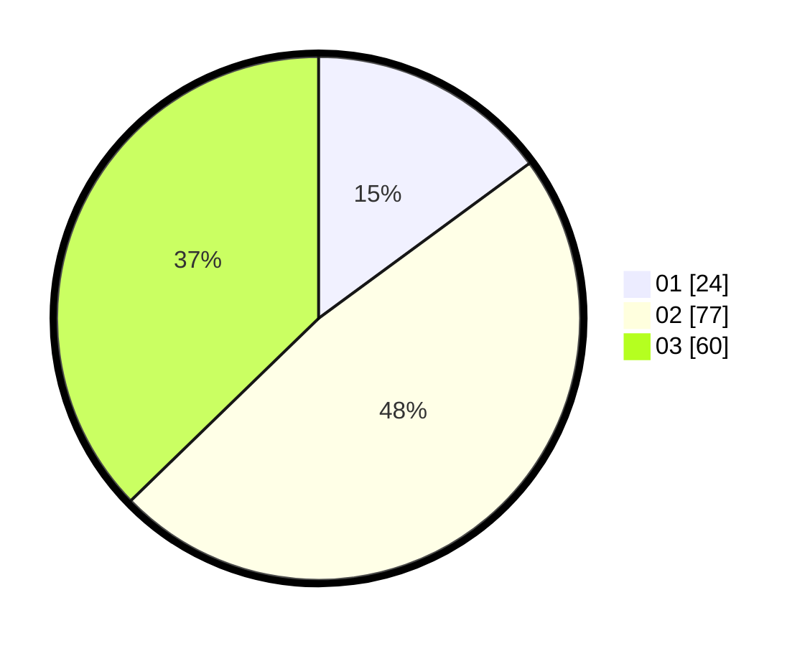

# Hasil

Hasil perolehan suara paslon dapat dilihat pada file paslon-01.txt, paslon-02.txt, dan paslon-03.txt.

Jika tidak ada, artinya data tersebut belum ada pada SIREKAP.

## Perolehan Suara

 * Paslon 01: **24**.
 * Paslon 02: **77**.
 * Paslon 03: **60**.

## Foto C Plano

https://sirekap-obj-formc.kpu.go.id/08a4/pemilu/ppwp/31/73/04/10/09/3173041009060-20240215-024717--260fa3a5-abc7-440b-8d95-0e24c635eaa7.jpg

https://sirekap-obj-formc.kpu.go.id/08a4/pemilu/ppwp/31/73/04/10/09/3173041009060-20240215-001325--aa22b788-39da-409c-a59c-10cf44632f78.jpg

https://sirekap-obj-formc.kpu.go.id/08a4/pemilu/ppwp/31/73/04/10/09/3173041009060-20240215-001415--44941a01-96ee-4f06-9775-d0ee18ce74e6.jpg
