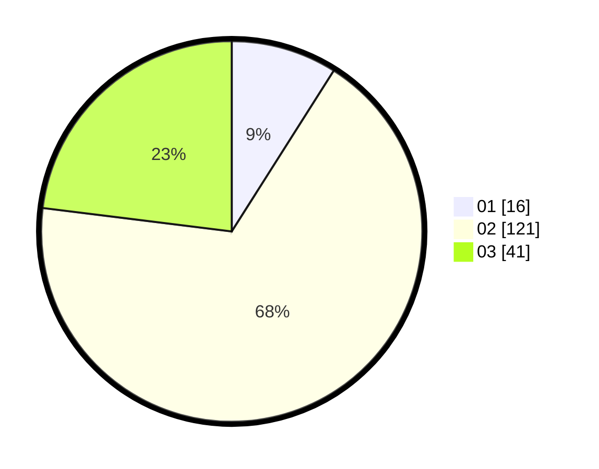

# Hasil

Hasil perolehan suara paslon dapat dilihat pada file paslon-01.txt, paslon-02.txt, dan paslon-03.txt.

Jika tidak ada, artinya data tersebut belum ada pada SIREKAP.

## Perolehan Suara

 * Paslon 01: **16**.
 * Paslon 02: **121**.
 * Paslon 03: **41**.

## Foto C Plano

https://sirekap-obj-formc.kpu.go.id/cbf1/pemilu/ppwp/31/73/04/10/09/3173041009064-20240214-213633--7d906ebb-bf94-44b1-a7f9-31aab577af55.jpg

https://sirekap-obj-formc.kpu.go.id/cbf1/pemilu/ppwp/31/73/04/10/09/3173041009064-20240214-222442--8e350339-fe56-4725-a128-8761a6d93fb0.jpg

https://sirekap-obj-formc.kpu.go.id/cbf1/pemilu/ppwp/31/73/04/10/09/3173041009064-20240214-220135--cb47bf27-b77c-4c67-95b1-8560e606c8af.jpg
