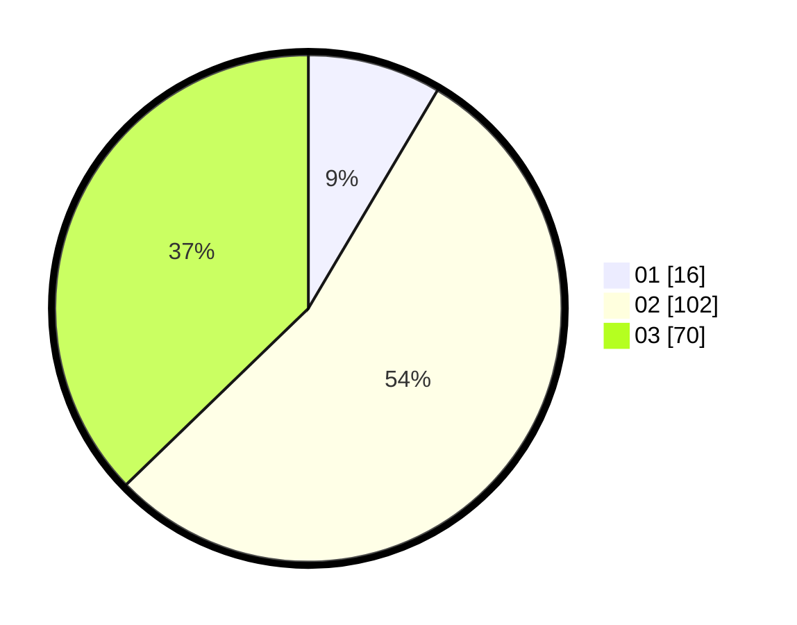

# Hasil

Hasil perolehan suara paslon dapat dilihat pada file paslon-01.txt, paslon-02.txt, dan paslon-03.txt.

Jika tidak ada, artinya data tersebut belum ada pada SIREKAP.

## Perolehan Suara

 * Paslon 01: **16**.
 * Paslon 02: **102**.
 * Paslon 03: **70**.

## Foto C Plano

https://sirekap-obj-formc.kpu.go.id/a549/pemilu/ppwp/31/73/04/10/09/3173041009065-20240214-190220--bc39a0e9-f076-46e0-8fb7-cc0065b18a30.jpg

https://sirekap-obj-formc.kpu.go.id/a549/pemilu/ppwp/31/73/04/10/09/3173041009065-20240214-190350--860e0af7-4635-4b26-a4a6-8427ccf5cb27.jpg

https://sirekap-obj-formc.kpu.go.id/a549/pemilu/ppwp/31/73/04/10/09/3173041009065-20240214-190434--a05ed27e-b482-4f3c-87fe-c205745a3aef.jpg

## DATA PEMILIH TETAP

Jumlah pemilih dalam DPT: **251**.
 * L: **126**.
 * P: **125**.

## DATA PENGGUNA HAK PILIH

Jumlah pengguna hak pilih dalam DPT: **187**.
 * L: **88**.
 * P: **99**.

Jumlah pengguna hak pilih dalam DPTb: **0**.
 * L: **0**.
 * P: **0**.

Jumlah pengguna hak pilih dalam DPK: **1**.
 * L: **0**.
 * P: **1**.

Jumlah pengguna hak pilih: **188**.
 * L: **88**.
 * P: **100**.

## JUMLAH SUARA SAH DAN TIDAK SAH

JUMLAH SELURUH SUARA SAH: **188**.

JUMLAH SUARA TIDAK SAH: **0**.

JUMLAH SELURUH SUARA SAH DAN SUARA TIDAK SAH: **188**.
