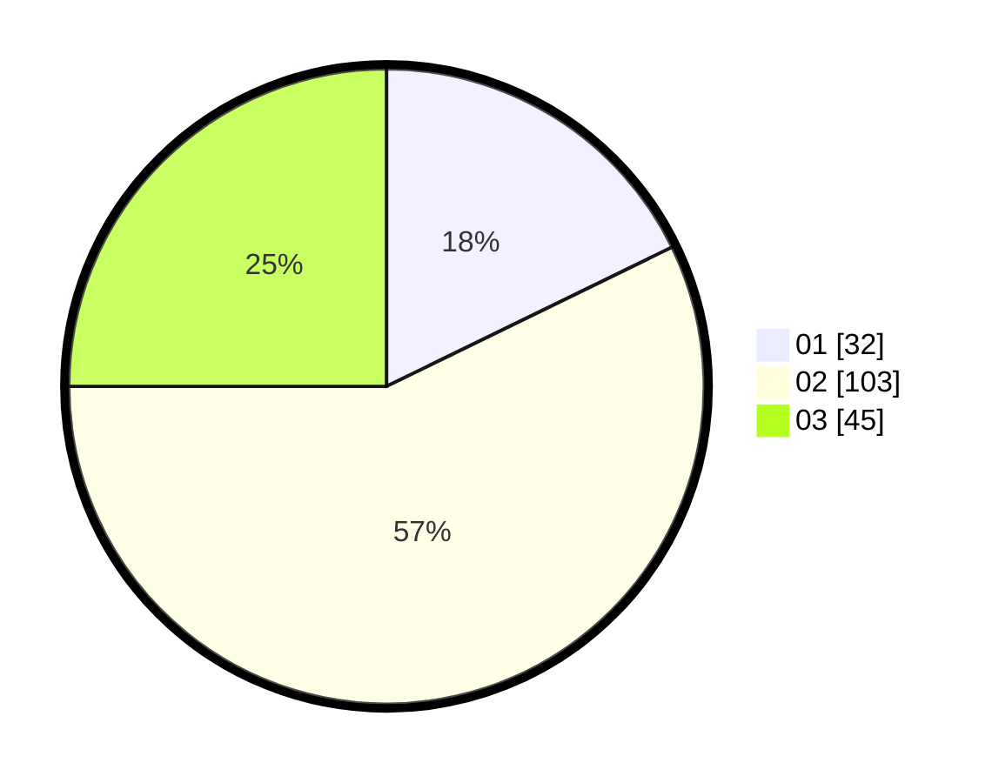

# Hasil

Hasil perolehan suara paslon dapat dilihat pada file paslon-01.txt, paslon-02.txt, dan paslon-03.txt.

Jika tidak ada, artinya data tersebut belum ada pada SIREKAP.

## Perolehan Suara

 * Paslon 01: **32**.
 * Paslon 02: **103**.
 * Paslon 03: **45**.

## Foto C Plano

https://sirekap-obj-formc.kpu.go.id/f999/pemilu/ppwp/31/73/04/10/09/3173041009068-20240214-204423--8dc479f5-06aa-4d6f-b393-ed88ebb26140.jpg

https://sirekap-obj-formc.kpu.go.id/f999/pemilu/ppwp/31/73/04/10/09/3173041009068-20240214-204609--327b374e-b766-4776-a137-37dffb8c5c28.jpg

https://sirekap-obj-formc.kpu.go.id/f999/pemilu/ppwp/31/73/04/10/09/3173041009068-20240214-204709--bc9ca0cd-4df2-462e-82b0-b60c53a6b64d.jpg
