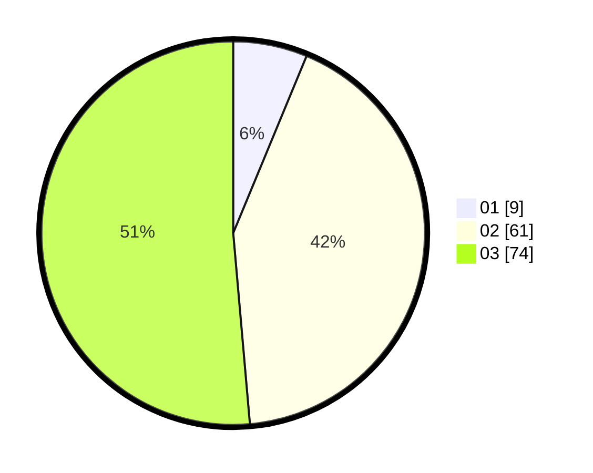

# Hasil

Hasil perolehan suara paslon dapat dilihat pada file paslon-01.txt, paslon-02.txt, dan paslon-03.txt.

Jika tidak ada, artinya data tersebut belum ada pada SIREKAP.

## Perolehan Suara

 * Paslon 01: **9**.
 * Paslon 02: **61**.
 * Paslon 03: **74**.

## Foto C Plano

https://sirekap-obj-formc.kpu.go.id/e65b/pemilu/ppwp/31/73/04/10/09/3173041009070-20240214-213032--169a7502-18d3-4513-bae4-0ebcaf929506.jpg

https://sirekap-obj-formc.kpu.go.id/e65b/pemilu/ppwp/31/73/04/10/09/3173041009070-20240214-195854--cc2eb808-b8e9-4712-92de-e7f6438524cb.jpg

https://sirekap-obj-formc.kpu.go.id/e65b/pemilu/ppwp/31/73/04/10/09/3173041009070-20240214-195940--3f365f41-5d90-4373-876f-562fead58bce.jpg

## DATA PEMILIH TETAP

Jumlah pemilih dalam DPT: **162**.
 * L: **71**.
 * P: **91**.

## DATA PENGGUNA HAK PILIH

Jumlah pengguna hak pilih dalam DPT: **158**.
 * L: **68**.
 * P: **90**.

Jumlah pengguna hak pilih dalam DPTb: **4**.
 * L: **3**.
 * P: **1**.

Jumlah pengguna hak pilih dalam DPK: **0**.
 * L: **0**.
 * P: **0**.

Jumlah pengguna hak pilih: **162**.
 * L: **71**.
 * P: **91**.

## JUMLAH SUARA SAH DAN TIDAK SAH

JUMLAH SELURUH SUARA SAH: **144**.

JUMLAH SUARA TIDAK SAH: **18**.

JUMLAH SELURUH SUARA SAH DAN SUARA TIDAK SAH: **162**.
