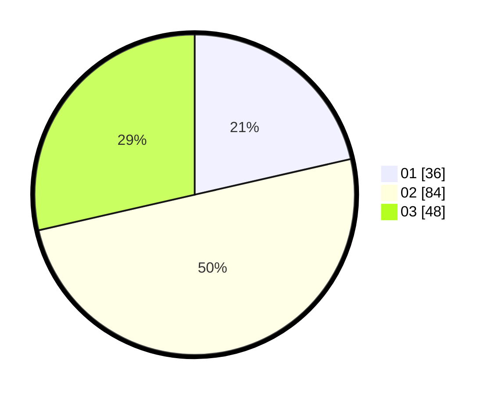

# Hasil

Hasil perolehan suara paslon dapat dilihat pada file paslon-01.txt, paslon-02.txt, dan paslon-03.txt.

Jika tidak ada, artinya data tersebut belum ada pada SIREKAP.

## Perolehan Suara

 * Paslon 01: **36**.
 * Paslon 02: **84**.
 * Paslon 03: **48**.

## Foto C Plano

https://sirekap-obj-formc.kpu.go.id/b572/pemilu/ppwp/31/73/04/10/09/3173041009073-20240214-212353--3cc7bad0-e5c9-4c7a-b254-8b6acc5b4add.jpg

https://sirekap-obj-formc.kpu.go.id/b572/pemilu/ppwp/31/73/04/10/09/3173041009073-20240214-234834--8012c8f5-ba19-489c-aced-8110a98b7c69.jpg

https://sirekap-obj-formc.kpu.go.id/b572/pemilu/ppwp/31/73/04/10/09/3173041009073-20240214-212548--5ba72d33-16e9-4b2f-86cc-f0e18ddd3477.jpg

## DATA PEMILIH TETAP

Jumlah pemilih dalam DPT: **242**.
 * L: **122**.
 * P: **120**.

## DATA PENGGUNA HAK PILIH

Jumlah pengguna hak pilih dalam DPT: **168**.
 * L: **82**.
 * P: **86**.

Jumlah pengguna hak pilih dalam DPTb: **0**.
 * L: **0**.
 * P: **0**.

Jumlah pengguna hak pilih dalam DPK: **3**.
 * L: **1**.
 * P: **2**.

Jumlah pengguna hak pilih: **168**.
 * L: **86**.
 * P: **82**.

## JUMLAH SUARA SAH DAN TIDAK SAH

JUMLAH SELURUH SUARA SAH: **168**.

JUMLAH SUARA TIDAK SAH: **3**.

JUMLAH SELURUH SUARA SAH DAN SUARA TIDAK SAH: **171**.
