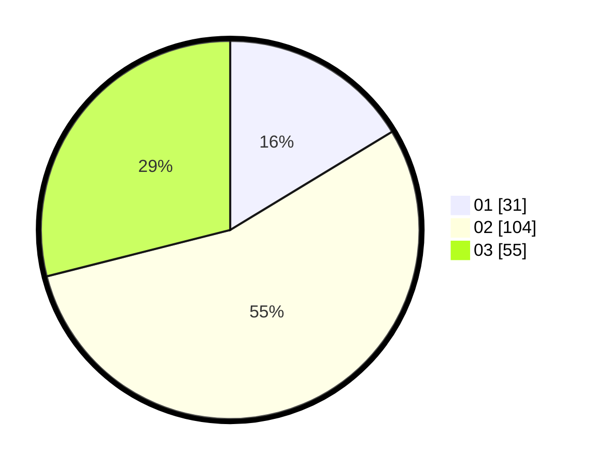

# Hasil

Hasil perolehan suara paslon dapat dilihat pada file paslon-01.txt, paslon-02.txt, dan paslon-03.txt.

Jika tidak ada, artinya data tersebut belum ada pada SIREKAP.

## Perolehan Suara

 * Paslon 01: **31**.
 * Paslon 02: **104**.
 * Paslon 03: **55**.

## Foto C Plano

https://sirekap-obj-formc.kpu.go.id/e6d3/pemilu/ppwp/31/73/04/10/09/3173041009075-20240214-205311--b490ecb8-0a13-4cc9-aac0-5cf1502ff6b7.jpg

https://sirekap-obj-formc.kpu.go.id/e6d3/pemilu/ppwp/31/73/04/10/09/3173041009075-20240214-205423--a76b39a9-10dd-4fba-88aa-34d9d3f444fe.jpg

https://sirekap-obj-formc.kpu.go.id/e6d3/pemilu/ppwp/31/73/04/10/09/3173041009075-20240214-205548--0ce9e35d-948c-4401-bec6-a86e3e4877dc.jpg

## DATA PEMILIH TETAP

Jumlah pemilih dalam DPT: **241**.
 * L: **121**.
 * P: **120**.

## DATA PENGGUNA HAK PILIH

Jumlah pengguna hak pilih dalam DPT: **185**.
 * L: **92**.
 * P: **93**.

Jumlah pengguna hak pilih dalam DPTb: **8**.
 * L: **2**.
 * P: **6**.

Jumlah pengguna hak pilih dalam DPK: **1**.
 * L: **0**.
 * P: **1**.

Jumlah pengguna hak pilih: **194**.
 * L: **94**.
 * P: **100**.

## JUMLAH SUARA SAH DAN TIDAK SAH

JUMLAH SELURUH SUARA SAH: **190**.

JUMLAH SUARA TIDAK SAH: **4**.

JUMLAH SELURUH SUARA SAH DAN SUARA TIDAK SAH: **194**.
