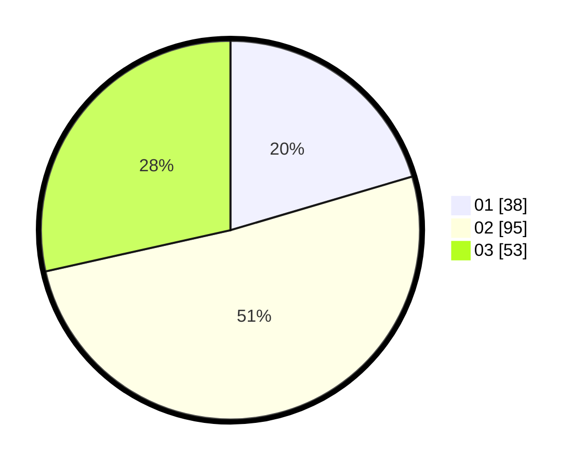

# Hasil

Hasil perolehan suara paslon dapat dilihat pada file paslon-01.txt, paslon-02.txt, dan paslon-03.txt.

Jika tidak ada, artinya data tersebut belum ada pada SIREKAP.

## Perolehan Suara

 * Paslon 01: **38**.
 * Paslon 02: **95**.
 * Paslon 03: **53**.

## Foto C Plano

https://sirekap-obj-formc.kpu.go.id/d1aa/pemilu/ppwp/31/73/04/10/09/3173041009077-20240214-231145--679787c1-3c26-4182-8d9f-21e519e7b63f.jpg

https://sirekap-obj-formc.kpu.go.id/d1aa/pemilu/ppwp/31/73/04/10/09/3173041009077-20240214-231229--bf8b5516-d2c0-4502-b029-5adf44fd4252.jpg

https://sirekap-obj-formc.kpu.go.id/d1aa/pemilu/ppwp/31/73/04/10/09/3173041009077-20240214-231259--51bd9451-6529-4d69-8a85-496348959d16.jpg

## DATA PEMILIH TETAP

Jumlah pemilih dalam DPT: **245**.
 * L: **114**.
 * P: **131**.

## DATA PENGGUNA HAK PILIH

Jumlah pengguna hak pilih dalam DPT: **174**.
 * L: **96**.
 * P: **78**.

Jumlah pengguna hak pilih dalam DPTb: **12**.
 * L: **6**.
 * P: **6**.

Jumlah pengguna hak pilih dalam DPK: **2**.
 * L: **0**.
 * P: **2**.

Jumlah pengguna hak pilih: **188**.
 * L: **102**.
 * P: **86**.

## JUMLAH SUARA SAH DAN TIDAK SAH

JUMLAH SELURUH SUARA SAH: **186**.

JUMLAH SUARA TIDAK SAH: **2**.

JUMLAH SELURUH SUARA SAH DAN SUARA TIDAK SAH: **188**.
