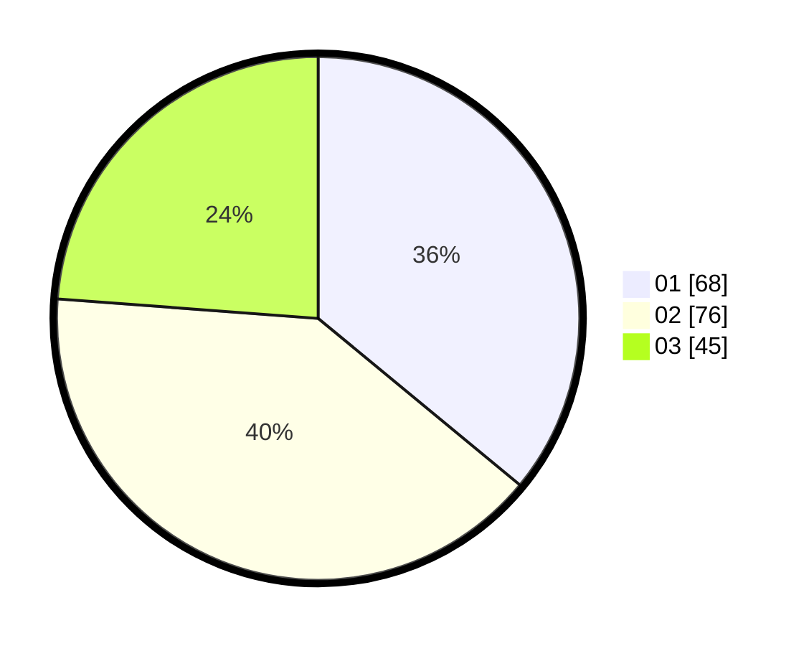

# Hasil

Hasil perolehan suara paslon dapat dilihat pada file paslon-01.txt, paslon-02.txt, dan paslon-03.txt.

Jika tidak ada, artinya data tersebut belum ada pada SIREKAP.

## Perolehan Suara

 * Paslon 01: **68**.
 * Paslon 02: **76**.
 * Paslon 03: **45**.

## Foto C Plano

https://sirekap-obj-formc.kpu.go.id/7249/pemilu/ppwp/31/73/04/10/09/3173041009079-20240214-193640--84c2e3cb-7906-49be-b333-57301d2e2def.jpg

https://sirekap-obj-formc.kpu.go.id/7249/pemilu/ppwp/31/73/04/10/09/3173041009079-20240214-193848--820cbf62-268c-4d6b-8aae-ba06ff53875f.jpg

https://sirekap-obj-formc.kpu.go.id/7249/pemilu/ppwp/31/73/04/10/09/3173041009079-20240214-193923--806fac1d-979c-4d73-9c86-1e8220b62e54.jpg

## DATA PEMILIH TETAP

Jumlah pemilih dalam DPT: **255**.
 * L: **132**.
 * P: **123**.

## DATA PENGGUNA HAK PILIH

Jumlah pengguna hak pilih dalam DPT: **194**.
 * L: **98**.
 * P: **96**.

Jumlah pengguna hak pilih dalam DPTb: **0**.
 * L: **0**.
 * P: **0**.

Jumlah pengguna hak pilih dalam DPK: **0**.
 * L: **0**.
 * P: **0**.

Jumlah pengguna hak pilih: **194**.
 * L: **98**.
 * P: **96**.

## JUMLAH SUARA SAH DAN TIDAK SAH

JUMLAH SELURUH SUARA SAH: **189**.

JUMLAH SUARA TIDAK SAH: **5**.

JUMLAH SELURUH SUARA SAH DAN SUARA TIDAK SAH: **194**.
