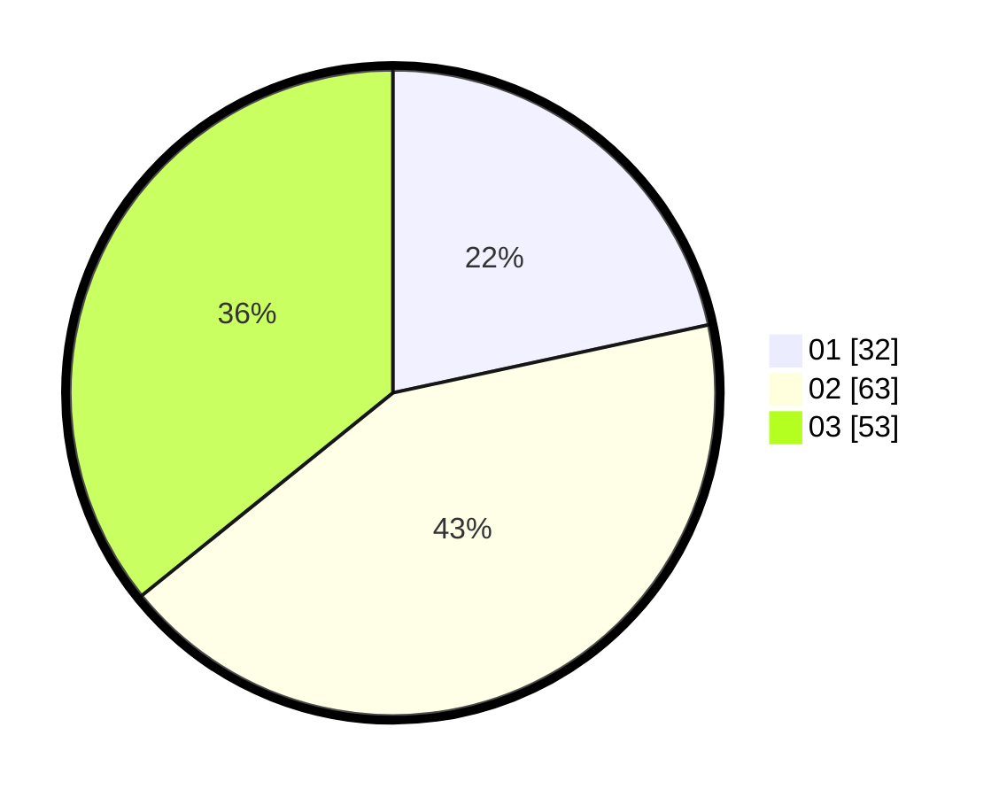

# Hasil

Hasil perolehan suara paslon dapat dilihat pada file paslon-01.txt, paslon-02.txt, dan paslon-03.txt.

Jika tidak ada, artinya data tersebut belum ada pada SIREKAP.

## Perolehan Suara

 * Paslon 01: **32**.
 * Paslon 02: **63**.
 * Paslon 03: **53**.

## Foto C Plano

https://sirekap-obj-formc.kpu.go.id/4711/pemilu/ppwp/31/73/04/10/09/3173041009083-20240215-183225--6e1e0b6c-ddaf-48e5-9fd2-946819963cfe.jpg

https://sirekap-obj-formc.kpu.go.id/4711/pemilu/ppwp/31/73/04/10/09/3173041009083-20240215-183247--335e9beb-aa96-44c3-804a-e659efdb8ea6.jpg

https://sirekap-obj-formc.kpu.go.id/4711/pemilu/ppwp/31/73/04/10/09/3173041009083-20240215-183236--7b7b56e3-2472-434f-b56d-24fa7b15770c.jpg

## DATA PEMILIH TETAP

Jumlah pemilih dalam DPT: **197**.
 * L: **95**.
 * P: **102**.

## DATA PENGGUNA HAK PILIH

Jumlah pengguna hak pilih dalam DPT: **147**.
 * L: **66**.
 * P: **81**.

Jumlah pengguna hak pilih dalam DPTb: **2**.
 * L: **1**.
 * P: **1**.

Jumlah pengguna hak pilih dalam DPK: **2**.
 * L: **1**.
 * P: **1**.

Jumlah pengguna hak pilih: **151**.
 * L: **68**.
 * P: **83**.

## JUMLAH SUARA SAH DAN TIDAK SAH

JUMLAH SELURUH SUARA SAH: **148**.

JUMLAH SUARA TIDAK SAH: **3**.

JUMLAH SELURUH SUARA SAH DAN SUARA TIDAK SAH: **151**.
