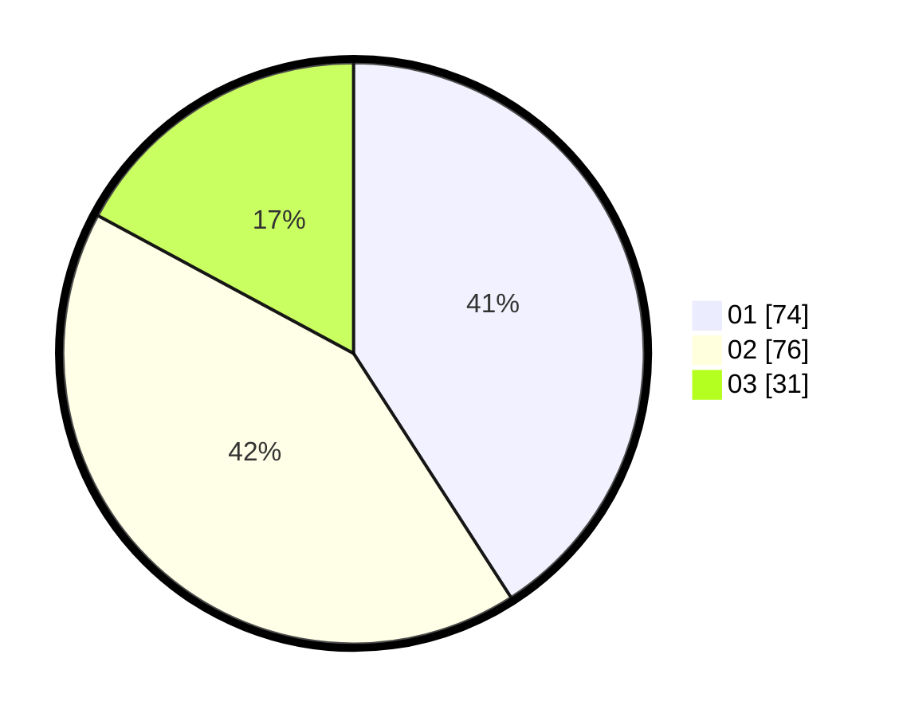

# Hasil

Hasil perolehan suara paslon dapat dilihat pada file paslon-01.txt, paslon-02.txt, dan paslon-03.txt.

Jika tidak ada, artinya data tersebut belum ada pada SIREKAP.

## Perolehan Suara

 * Paslon 01: **74**.
 * Paslon 02: **76**.
 * Paslon 03: **31**.

## Foto C Plano

https://sirekap-obj-formc.kpu.go.id/de14/pemilu/ppwp/31/73/04/10/09/3173041009084-20240215-120727--373d35ff-33dc-48b5-8da1-c19ece6218cf.jpg

https://sirekap-obj-formc.kpu.go.id/de14/pemilu/ppwp/31/73/04/10/09/3173041009084-20240215-120748--28d50a57-74b5-4e32-949f-60a06ce0fdc3.jpg

https://sirekap-obj-formc.kpu.go.id/de14/pemilu/ppwp/31/73/04/10/09/3173041009084-20240215-120737--95469147-84d8-4fa4-8a5d-723b3dc72ed1.jpg

## DATA PEMILIH TETAP

Jumlah pemilih dalam DPT: **224**.
 * L: **114**.
 * P: **110**.

## DATA PENGGUNA HAK PILIH

Jumlah pengguna hak pilih dalam DPT: **188**.
 * L: **95**.
 * P: **93**.

Jumlah pengguna hak pilih dalam DPTb: **0**.
 * L: **0**.
 * P: **0**.

Jumlah pengguna hak pilih dalam DPK: **0**.
 * L: **0**.
 * P: **0**.

Jumlah pengguna hak pilih: **188**.
 * L: **95**.
 * P: **93**.

## JUMLAH SUARA SAH DAN TIDAK SAH

JUMLAH SELURUH SUARA SAH: **181**.

JUMLAH SUARA TIDAK SAH: **7**.

JUMLAH SELURUH SUARA SAH DAN SUARA TIDAK SAH: **188**.
